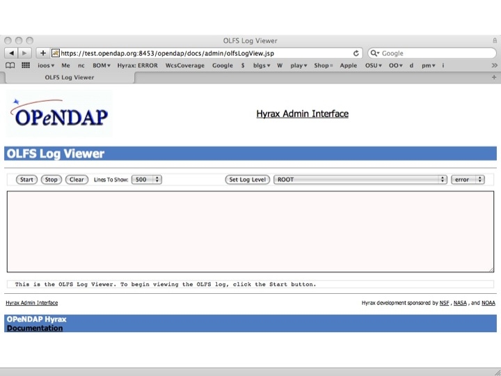
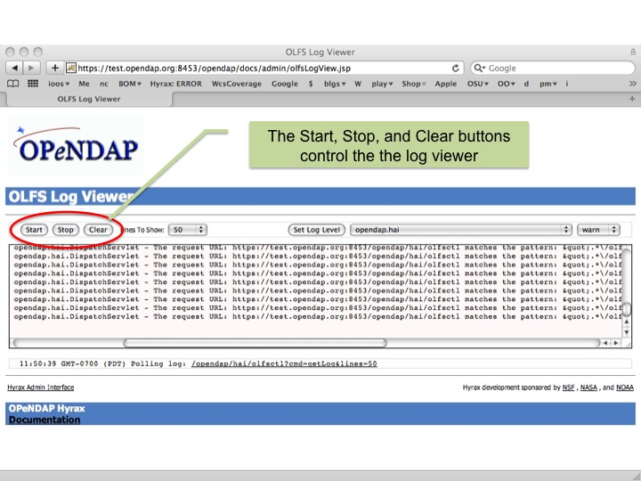
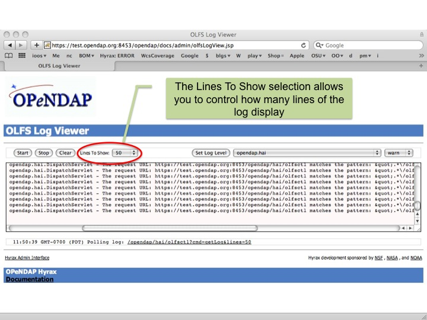
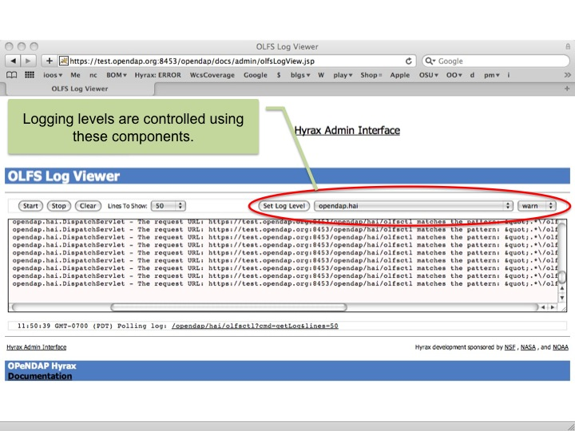
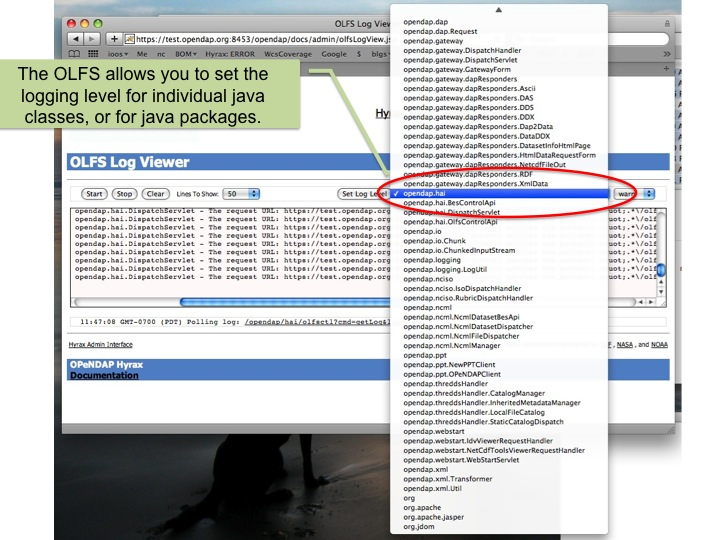
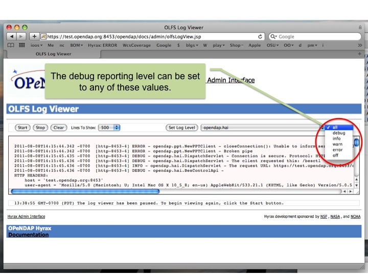
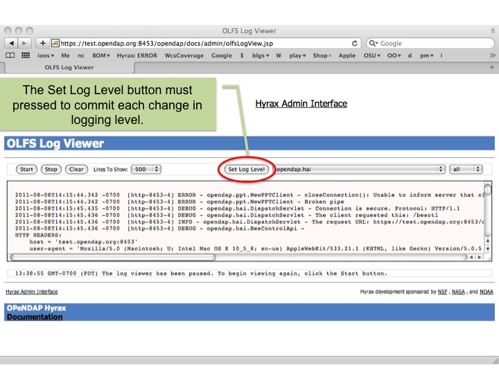
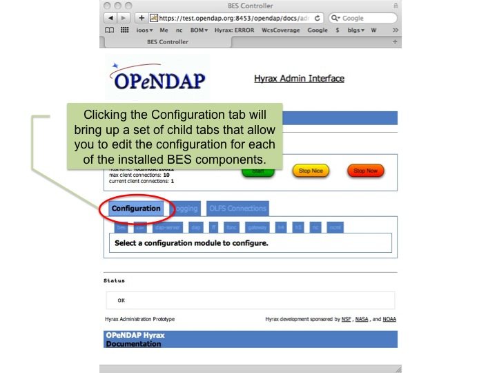
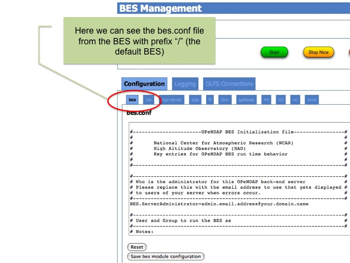

//= Hyrax Administrators Interface
//:Leonard Porrello <lporrel@gmail.com>:
//{docdate}
//:numbered:
//:toc:

== Administrator's Interface Overview

The Hyrax Administrator's Interface (HAI) is a graphical interface to
the configuration files and run-time logs of the Hyrax data server. It
provides a way to start and stop different parts of Hyrax and to change
their configuration files on the fly. Because Hyrax can run on several
different hosts, it can be a challenge to manage; the HAI provides a
single tabbed interface where the logs and configuration files for those
different hosts can easily be tracked.

The HAI is a web based interface, so it can be used from any computer
that can access the server using a secure connection.

The following describes the installation and configuration of the HAI
followed by an explanation of its features. Note that the interface is
very simple to configure in most cases - most of the steps described for
Tomcat are not necessary for many sites since it's often the case that
the servlet engine is already configured for SSL and has one or more
users in Tomcat's _manager_ role. Using the interface is very intuitive.

== Installation and Configuration

When Hyrax and Tomcat are installed all of the software needed to run
the Hyrax Administrative Interface (HAI) is in place. However, you will
need to do three simple steps in order to turn it in and use it. First
you will need to configure Tomcat to use Secure Sockets Layer (SSL,
https) and add a user who can login to use the interface. Then you will
need to perform minimal additional configuration steps in the two parts
of Hyrax - the BES and OLFS. Be sure to skim the Configuration Notes
subsection.

Prerequisites:

* Tomcat 6 installed and working, and
* Hyrax has been installed and simple responses work.
* It's very likely that newer versions of Tomcat will work and it's also
likely that you can use another servlet engine, but the specifics of the
SSL/https configuration may be different.

=== Configuring Tomcat

In order to use the HAI you will need to configure your tomcat instance
to enable SSL. This is very simple for most sites, and it might already
be configured for you. We use SSL/https for communication with the HAI
because we want to be sure that your server is secure and only those
people who you want to control it can. There is a much more detailed
document that describes the
http://tomcat.apache.org/tomcat-7.0-doc/ssl-howto.html[SSL/https
configuration] for tomcat 7 at the Apache web site.

Make a Certificate 'keystore'

Use the command "keytool -genkey -alias tomcat -keyalg RSA" to make a
_keystore_ - a place where SSL certificates are stored so they can be
used by the server - and add a single _self signed_ certificate in it.
Make sure to remember the password for the keystore! If your
installation of Tomcat is already configured for SSL, skip this step -
you don't need to make the keystore or the self-signed certificate. Also
note that if the _keytool_ program cannot be run from a terminal, try
using it's full path with is _$JAVA_HOME/bin/keytool_ (Unix/OSX) or
_%JAVA_HOME%\bin\keytool_ (Windows).

Turn on SSL/https

In the file _$CATALINA_BASE/conf/server.xml_ remove the comment
surrounding the "SSL HTTP/1.1 Connector" entry. For Tomcat 7, add
attributes for the keystore and keystore password (e.g.,
__keystoreFile="$\{user.home}/.keystore" keystorePass="changeit"__) to
SSL HTTP/1.1 Connector entry.

Add a Tomcat user

Open the file _$CATALINA_HOME/conf/tomcat-users.xml_ and add a user for
the interface. Hyrax uses, by default, the _role_ 'manager', so if you
already have a user in that role an want them to use the HAI, you are
all set. If you don't have anyone set in the manager role, or you want a
new user, add a line like the following: __<user username="admin"
password="hai" roles="manager"/>__. If you don't have the role 'manager'
defined, add it too: _<role rolename="manager"/>_

Restart Tomcat

=== BES

Edit the file _$HYRAX_HOME/etc/bes.conf_ and remove the comments from
the line _BES.DaemonPort=11002_

Restart the BES.

=== OLFS

Edit the file _$CATALINA_HOME/content/opendap/olfs.xml_ and remove the
comments around the line _<adminPort>11002</adminPort>_

=== Configuration Notes

. Note that because the HAI is a web-based interface, with secure
logins using SSL, you can use the interface with your server from
anywhere in the world. It might be a good idea, however, to limit the IP
addresses that can access the HAI.
. Using a self-signed certificate is fine, but you will see a warning
box when you log in because self-signed certs are not trusted by
browsers by default. Most browsers have an option that will suppress
that warning or, although it involves some expense, you can get a
certificate signed by a Certificate Authority and install that in the
keystore
. More about tomcat users: Tomcat supports several authentication
Realms including Memory realms, databases and LDAP. We document using
memory realms here because other techniques, while better in some ways,
are more cumbersome. If you are using memory realms, be sure to protect
the _tomcat-users.xml_ file because it contains plain text passwords.
. The _<security-constraint>_ element in the
_$CATALINA_HOME/opendap/WEB-INF/web.xml_ configuration file controls the
level of access control for the HAI
. The role used by the HAI is set in the
_$CATALINA_HOME/opendap/WEB-INF/web.xml_ configuration file using the
_<auth-constraint>_ element. You can switch roles by changing the
__<role-name>__.

== Using the Hyrax Administrator's Interface

To access the Hyrax Administrator's Interface, go to the base page for
your server (http://__you server__/opendap) and follow the link to the
__Hyrax Admin Interface__. Following that link will present a page where
you login to the interface proper. Use the username and password for a
user assigned to the _manager_ role for your Tomcat server (see the
configuration information above for more information about Tomcat users
and roles). Once logged in to the HAI, you will see a page with two main
links; one for the Hyrax front-end and one link for the back-end
servers. Together the front-end and the back-end servers make up one
installation of Hyrax and they can be spread across several machines.
Generally the front-end is run on a host that is outside your
institution's firewall, while the back-end servers are inside that
firewall on hosts where data are located. It may be helpful to review
how link:../index.php/Hyrax#Overview[Hyrax] is structured: Hyrax is
composed of one link:../index.php/Hyrax_-_OLFS_Configuration[front-end
server (OLFS)] and one or more
link:../index.php/Hyrax_-_BES_Configuration[back-end server (BES)]
process.

Since there is just one instance of the front-end, it has a fairly
simple control panel. The back-end servers' control panel is a little
more complex because there can be many different back-end servers all
part of one Hyrax installation. Use the tabs at the top of the interface
to select different back-end server instances. The following sections
describe both parts of the interface.

=== OLFS Log Viewer

The OLFS control panel provides access to the log for the front-end of
Hyrax. Note that the control panel provides a way to set the logging
level for individual classes that make up the front end of the server;
this is very useful for debugging and testing new front-end plugins but
it rarely needed in an operation setting. The default logging level
shipped with the server is generally the most useful level of detail. By
default the log lines are not displayed - just click the start button to
see them.

==== Log Viewer Controls

==== Setting Logging Levels

=== BES Controls

The BES control panel provides one tab for each back-end server in this
instance of Hyrax. Note that in these pictures we have only one BES
running and it is called '/' (slash) meaning it is the default BES.

image:..\images\Besctl-01.jpg[]

Beneath the "BES Management " banner you will see one or more tabs. You
will always see a tab with the title of "/". This is the default BES for
this Hyrax. If the particular installation of Hyrax has multiple BES
configured in its OLFS they will appear here as tabs where the "prefix"
for the BES from the olfs.xml file will be used as the tab title.

image:../images/Hai-Slide02.jpg[Admin
Page Tour 1]

image:../images/Hai-Slide03.jpg[Admin
Page Tour 2]

==== BES Configuration

==== BES Logging

image:../images/Hai-Slide06.jpg[BES
Logging 1]

image:../images/Hai-Slide07.jpg[BES
Logging 2]

image:../images/Hai-Slide08.jpg[BES
Logging Configuration 1]

image:../images4/Hai-Slide09.jpg[BES
Logging 3]

==== OLFS Connections

image:../images/Hai-Slide10.jpg[OLFS
Connections 1]

image:../images/Hai-Slide11.jpg[OLFS
Connections 2]
