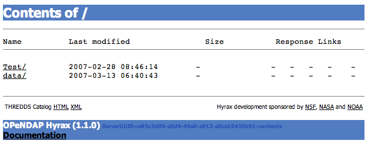
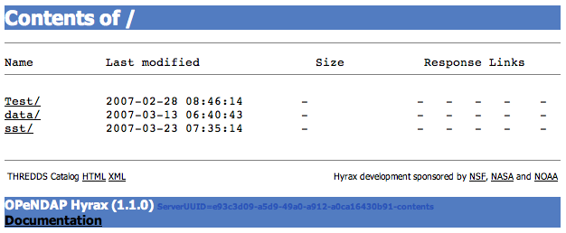

//= Hyrax - Configuring The OLFS To Work With Multiple BES's - OPeNDAP Documentation
//:Leonard Porrello <lporrel@gmail.com>:
//{docdate}
//:numbered:
//:toc:

== Introduction to Configuring The OLFS To Work With Multiple BES's

Configuring Hyrax to use multiple BES backends is straight forward. It
will require that you edit the *olfs.xml* file and possible the
*catalog.xml* file.

== Top Level (__root__) BES

Every installation of Hyrax requires a top level (or _root_ level)
BES. This BES has a _prefix_ of "/" (the forward slash character). The
prefix is a URL token between the server address/port and catalog root
used to designate a particular BES instance in the case that multiple
Back-End-Servers are available to a single OLFS. The default (for a
single BES) is no additional tag, designated by "/". The prefix is used
to provide a mapping for each BES connected to the OLFS to URI space
serviced by the OLFS.

In a single BES deployment this BES would contain all of the data
resources to be made visible in Hyrax. In the THREDDS _catalog.xml_ file
each top level directory/collection would have it's own
<__datasetScan__> element.

__Note:__ The word _root_ here has *absolutely nothing* to do with
the login account called root associated with the super user or system
administrator.

== Single BES Example (Default)

Here is the <__Handler__> element in an *olfs.xml* that defines the
opendap.bes.BESManager file that configures the OLFS to use a single
BES, the default configuration arrangement for Hyrax:

----
    <Handler className="opendap.bes.BESManager">
        <BES>
            <prefix>/</prefix>
            <host>localhost</host>
            <port>10022</port>
            <ClientPool maximum="10" />
        </BES>
    </Handler>
----

The BES is running on the same system as the OLFS, and it's prefix is
correctly set to "/". This BES will handle all data requests directed at
the OLFS and will expose it's top level directory/collection/catalog in
the URI space of the OLFS here:

----
http://localhost:8080/opendap/
----

The THREDDS *catalog.xml* file for this should contain a
<__datasetScan__> element for each of the top level directories |
collections | catalogs that the BES exposes at the above URI.

__*Remember*__: There *must* be one (but only one) BES configured with
the <__prefix__> set to "/" in your *olf.xml* file.

== Multiple BES examples

Here is a BESManager <__Handler__> element that defines two BES's:

----
    <Handler className="opendap.bes.BESManager">

        <BES>
            <prefix>/</prefix>
            <host>localhost</host>
            <port>10022</port>
            <ClientPool maximum="10" />
        </BES>
        
        <BES>
            <prefix>/sst</prefix>
            <host>comet.test.org</host>
            <port>10022</port>
            <ClientPool maximum="10" />
        </BES>

    </Handler>
----

The first one is running on the same system as the OLFS, the second on
__comet. test.org__. The second BES is mapped to the prefix /sst. So the
URL:

----
http://localhost:8080/opendap/
----

Will return the directory view at the top level of the first BES,
running on the same system as the OLFS. The URL:

----
http://localhost:8080/opendap/sst
----

Will return the directory view at the top level of the second BES,
running on __comet.test.org__.

You can repeat this pattern to add more BES's to the configuration. This
next example shows a configuration with 4 BES's: The _root_ BES, and 3
others:

----
    <Handler className="opendap.bes.BESManager">

        <BES>
            <prefix>/</prefix>
            <host>server0.test.org</host>
            <port>10022</port>
            <ClientPool maximum="10" />
        </BES>
        
        <BES>
            <prefix>/sst</prefix>
            <host>server1.test.org</host>
            <port>10022</port>
            <ClientPool maximum="10" />
        </BES>

        <BES>
            <prefix>/chl-a</prefix>
            <host>server2.test.org</host>
            <port>10022</port>
            <ClientPool maximum="10" />
        </BES>

        <BES>
            <prefix>/salinity</prefix>
            <host>server3.test.org</host>
            <port>10022</port>
            <ClientPool maximum="10" />
        </BES>

    </Handler>
----

Note that in this example:

. The _root_ BES is not necessarily running on the same host as the
OLFS.
. Every BES has a different prefix.
. The OLFS would direct requests so that requests to:
* http://localhost:8080/opendap/sst/* are handled by the BES at
server1.test.org
* http://localhost:8080/opendap/chl-a/* are handled by the BES at
server2.test.org
* http://localhost:8080/opendap/salinity/* are handled by the BES at
server3.test.org
* The BES at server0.test.org would handle everything else.

== Mount Points

In a multiple BES installation each additional BES must have a _mount
point_ within the exposed hierarchy of collections for it to be visible
in Hyrax.

Consider, if you have this configuration:

----
    <Handler className="opendap.bes.BESManager">

        <BES>
            <prefix>/</prefix>
            <host>server0.test.org</host>
            <port>10022</port>
            <ClientPool maximum="10" />
        </BES>
        
    </Handler>
----

And the top level directory for the _root_ BES looks like this:

If you add another BES, like this:

----
    <Handler className="opendap.bes.BESManager">

        <BES>
            <prefix>/</prefix>
            <host>server0.test.org</host>
            <port>10022</port>
            <ClientPool maximum="10" />
        </BES>
        
        <BES>
            <prefix>/sst</prefix>
            <host>server5.test.org</host>
            <port>10022</port>
            <ClientPool maximum="10" />
        </BES>
        
    </Handler>
----

*It will not appear in the top level directory unless you create a
__mount point__.* This simply means that on the file system served by
the _root_ BES you would need to create a directory called "sst" in the
top of the directory tree that the _root_ BES is exposing. In other
words, simply create a directory called "sst" in the same directory that
contains the "Test" and "data" directories on server0.test.org. After
you did that your top level directory would look like this:

This holds true for any arrangement of BESs that you make. The location
of the _mount point_ will depend on your configuration, and how you
organize things. Here is a more complex example.

Consider this configuration:

----
    <Handler className="opendap.bes.BESManager">

        <BES>
            <prefix>/</prefix>
            <host>server0.test.org</host>
            <port>10022</port>
            <ClientPool maximum="10" />
        </BES>
        
        <BES>
            <prefix>/GlobalTemperature </prefix>
            <host>server1.test.org</host>
            <port>10022</port>
            <ClientPool maximum="10" />
        </BES>
        
        <BES>
            <prefix>/GlobalTemperature/NorthAmerica</prefix>
            <host>server2.test.org</host>
            <port>10022</port>
            <ClientPool maximum="10" />
        </BES>
        
        <BES>
            <prefix>/GlobalTemperature/NorthAmerica/Canada </prefix>
            <host>server3.test.org</host>
            <port>10022</port>
            <ClientPool maximum="10" />
        </BES>
        
        <BES>
            <prefix>/GlobalTemperature/NorthAmerica/USA </prefix>
            <host>server4.test.org</host>
            <port>10022</port>
            <ClientPool maximum="10" />
        </BES>
        
        <BES>
            <prefix>/GlobalTemperature/Europe/France </prefix>
            <host>server4.test.org</host>
            <port>10022</port>
            <ClientPool maximum="10" />
        </BES>
        
    </Handler>
----

* The _mount point_ "GlobalTemperature" must be in the top of the
directory tree that the _root_ BES on server0.test.org is exposing.
* The _mount point_ "NorthAmerica" must be in the top of the directory
tree that the BES on server1.test.org is exposing.
* The _mount point_ "Canada" must be in the top of the directory tree
that the BES on server2.test.org is exposing.
* The _mount point_ "USA" must be in the top of the directory tree that
the BES on server2.test.org is exposing.
* The _mount point_ "France" must be located at
"GlobalTemperature/Europe/France" relative to the top of the directory
tree that the BES on server0.test.org is exposing.

== Complete olfs.xml with multiple BES installations example

----
<?xml version="1.0" encoding="UTF-8"?>
<OLFSConfig>

    <DispatchHandlers>

        <HttpGetHandlers>

            <Handler className="opendap.bes.BESManager">

                <BES>
                    <prefix>/</prefix>
                    <host>server0.test.org</host>
                    <port>10022</port>
                    <ClientPool maximum="10" />
                </BES>
                
                <BES>
                    <prefix>/GlobalTemperature </prefix>
                    <host>server1.test.org</host>
                    <port>10022</port>
                    <ClientPool maximum="10" />
                </BES>
                
                <BES>
                    <prefix>/GlobalTemperature/NorthAmerica</prefix>
                    <host>server2.test.org</host>
                    <port>10022</port>
                    <ClientPool maximum="10" />
                </BES>
                
                <BES>
                    <prefix>/GlobalTemperature/NorthAmerica/Canada </prefix>
                    <host>server3.test.org</host>
                    <port>10022</port>
                    <ClientPool maximum="10" />
                </BES>
                
                <BES>
                    <prefix>/GlobalTemperature/NorthAmerica/USA </prefix>
                    <host>server4.test.org</host>
                    <port>10022</port>
                    <ClientPool maximum="10" />
                </BES>
                
                <BES>
                    <prefix>/GlobalTemperature/Europe/France </prefix>
                    <host>server4.test.org</host>
                    <port>10022</port>
                    <ClientPool maximum="10" />
                </BES>

            </Handler>

            <Handler className="opendap.coreServlet.SpecialRequestDispatchHandler" />
            
            <Handler className="opendap.bes.VersionDispatchHandler" />

            <Handler className="opendap.bes.DirectoryDispatchHandler">
                <DefaultDirectoryView>OPeNDAP</DefaultDirectoryView>
            </Handler>

            <Handler className="opendap.bes.DapDispatchHandler" />

            <Handler className="opendap.bes.FileDispatchHandler" >
                <!-- <AllowDirectDataSourceAccess /> -->
            </Handler>

            <Handler className="opendap.bes.ThreddsDispatchHandler" />

        </HttpGetHandlers>

        <HttpPostHandlers>
            <Handler className="opendap.coreServlet.SOAPRequestDispatcher" >
                <OpendapSoapDispatchHandler>opendap.bes.SoapDispatchHandler</OpendapSoapDispatchHandler>
            </Handler>
        </HttpPostHandlers>

    </DispatchHandlers>

</OLFSConfig>
----

