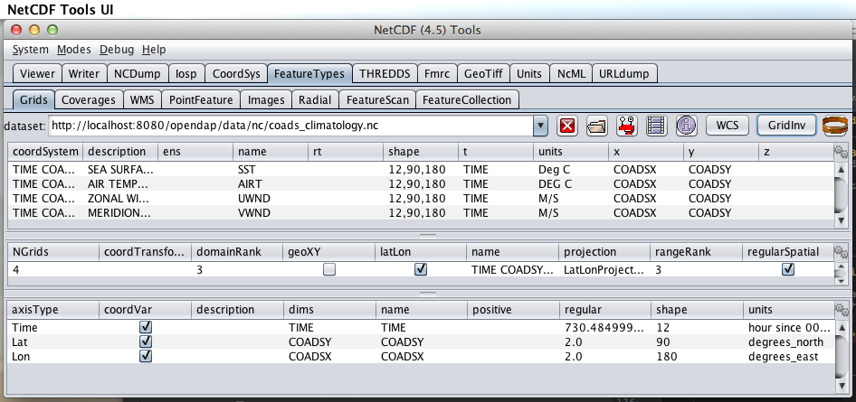

= Hyrax WMS - OPeNDAP Documentation
:Leonard Porrello <lporrel@gmail.com>:
{docdate}
:numbered:
:toc:

== Overview

With the recent addition of the Dynamic Services feature in the
http://www.resc.rdg.ac.uk/trac/ncWMS/[ncWMS2 WMS Server] from
http://www.resc.reading.ac.uk/[Reading e-Science Centre] Hyrax can now
provide WMS services for all of it's appropriate holdings.

=== Theory of Operation

In an instance of the ncWMS2 WMS server, a Dynamic Service is configured
that points to a Hyrax server. This allows the ncWMS2 instance to access
all of the holdings of the DAP server. However, the ncWMS2 does not
"crawl" or "discover" or in any other way catalog or inventory the DAP
server. Instead the user configures the Hyrax server to add the WMS
service to its catalogs and services content. Hyrax then directs WMS
traffic to the ncWMS2 instance. The ncWMS2 in turn retrieves the data
directly from Hyrax and services the request.

The ncWMS2 instance may be hosted anywhere, however for a significant
performance improvement we suggest you host your own ncWMS2 running in
the same Tomcat instance as Hyrax's OLFS. With such a configuration the
WMS response performance for datasets backed by the DAP service is
nearly as fast as the ncWMS2 response performance using direct file
access.

=== Evaluating Candidate Datasets

In order for ncWMS2 to recognize your dataset as valid for service your
data must:

* Contain gridded data (as DAP Grid objects or DAP Array objects
utilizing shared dimensional coordinate arrays)
**http://www.unidata.ucar.edu/software/thredds/v4.3/netcdf-java/tutorial/GridDatatype.html[as
described by the Unidata Common Data Model]**.
* The NetCDF-Java library (which is what provides data access services
for ncWMS2) utilizes the Common Data Model and must be able to identify
the coordinates system used. You can test this by using the
*http://www.unidata.ucar.edu/software/thredds/current/netcdf-java/documentation.htm[Unidata
ToolsUI application]* (which is also based on the NetCDF-Java library).
Open your dataset with **ToolsUI**, and in the *Feature Types -> Grid
Panel* there should be one or more variables shown with some kind of
coordinate system.

ToolsUI Grid View

------------------------------------------------------------------------------------------
Note that ToolsUI supports opening both local files and remote (http accessible) datasets.
------------------------------------------------------------------------------------------

== WMS Installation (suggested)

The ncWMS2 web application is easy to install.

Simply:

* Retrieve the latest stable release from
https://github.com/Reading-eScience-Centre/edal-java/releases

* Copy the WAR files _ncWMS2.war_ and _opendap.war_ into the
_$CATALINA_HOME/webapps_ directory

* Restart Tomcat

== OLFS/Hyrax Installation

As of the release of Hyrax 1.11 (and in particular OLFS 1.13.0) the
support for WMS will be built into the server. All that is required is a
(collocated) ncWMS2 instance and then the configuration steps as
detailed below. So - get the latest Hyrax (1.11.0 or later) install and
configure using the normal methods and then follow the configuration
steps detailed below.

== Co-Configuration

The following sub sections assume that you have installed both Hyrax and
the ncWMS2 on your server in a single Tomcat instance running on port
8080. If your arrangement is otherwise you will need to adjust
accordingly.

For the following example sections we will use the following URLs:

* Your Tomcat server: http://servername.org:8080/
* Top level of DAP server: http://servername.org:8080/opendap
* Top Level of ncWMS2: http://servername.org:8080/ncWMS2
* WMS Service: http://servername.org:8080/ncWMS2/wms
* Godiva: http://servername.org:8080/ncWMS2/Godiva3.html

=== ncWMS2 configuration

==== Authenticate as the Administrator

In order to access the ncWMS2 administration page (which you must do in
oder to configure the server) you will need to configure authentication
and access control for the page, or you will need to temporarily disable
access control for the page in order to configure the server (I strongly
recommend the former).

The default security configuration for ncWMS2 can be located (after
initial launch) in the file:

`$CATALINA_HOME/webapps/ncWMS2/WEB-INF/web.xml`

This configuration stipulates that access to the _ncWMS2/admin_ pages
must be over a secure transport and that there will be no access without
being authenticated and in the *`manager`* role:

------------------------------------------------------------------------------

<!-- Define a Security Constraint on the Admin command and user interfaces -->
<security-constraint>
    <web-resource-collection>
        <web-resource-name>admin</web-resource-name>
        <url-pattern>/admin/*</url-pattern>
    </web-resource-collection>
 
    <auth-constraint>
        <role-name>manager</role-name>
    </auth-constraint>
 
    <user-data-constraint>
        <transport-guarantee>CONFIDENTIAL</transport-guarantee>
    </user-data-constraint>
</security-constraint>
------------------------------------------------------------------------------

Your choices:

1.  *Use Apache httpd to provide authentication services for your
installation.*
1.  Comment out the `security-constraint` in the `web.xml` file for
ncWMS2.
2.  Correctly integrate Tomcat and Apache using the AJP connector.
3.  Configure an Apache httpd `<Location>` directive for the
`ncWMS2/admin` page.
4.  Write the directive to restrict access to specific users.
2.  *Use Tomcat authentication.*
1.  Leave the `security-constraint` in place.
2.  Correctly configure Tomcat to use some type authentication (e.g.,
MemoryRealm).
3.  Modify the `security-constraint` to reflect your authentication
configuration. (Different role? HTTPS? etc.)
3.  *Temporarily Disable the `security-constraint`.*
1.  Comment out the `security-constraint` in the `web.xml` file for
ncWMS2.
2.  Finish the configuration steps below.
3.  At the end, when it's working, go back and un-comment the
`security-constraint` in the web.xml file for ncWMS2.
4.  Restart Tomcat.

Now that you can get to it, go to the ncWMS2 administration page:
http://servername.org:8080/ncWMS2/admin/

*NB:* _Any changes you make to the `web.xml` are volatile!
Installing/Upgrading/Reinstalling the web archive (.war) file will
overwrite `web.xml` file. Make a back-up copy of the `web.xml` in a
different, more durable location._

==== Configure a Dynamic Service

Once you have authenticated and can view the ncWMS2 admin page, scroll
down to the Dynamic Services section:

image:../images/Screen_Shot_2014-08-11_at_12.34.19_PM.png[]

Create a new Dynamic Service for Hyrax:

* Choose and enter a unique ID. (Using 'lds' will save you the trouble
of having to edit the olfs configuration viewers.xml file to adjust that
value.) Write down the string/name you use because you'll need it later.
* The value of the _Service URL_ field will be the URL for the top level
of the Hyrax server.
** If the Hyrax server and the ncWMS2 server are running together in a
single Tomcat instance then this URL *should* be expressed as:
http://localhost:8080/opendap
** If the Hyrax server and the ncWMS2 server are running on separate
systems this URL *must* be a DAP server top level URL, and not a
localhost URL.
** *Best WMS response performance will be achieved by running ncWMS2 and
Hyrax on the same server and providing the _localhost_ URL here.*
* The Dataset Match Regex should be a regex that matches of all of the
data files you have for which WMS can prove services. If that's too
cumbersome then just use '.*' (as in the example) which matches
everything.
* Scroll to the bottom of the page and save the configuration.

*Summary*

[width="100%",cols="16%,12%,12%,12%,12%,12%,12%,12%",options="header",]
|=======================================================================
|Unique ID |Service URL |Dataset Match Regex |Disabled? |Remove |Data
Reading Class |Link to more info |Copyright Statement
|lds |http://localhost:8080/opendap |.* | | | | |
|=======================================================================

=== Hyrax Configuration

The Hyrax WMS configuration is contained in the file
__$OLFS_CONFIG_DIR/viewers.xml__. This file identifies data viewers and
Web Services that Hyrax can provide for datasets. There are two relevant
sections, the first defines Hyrax's view of the WMS service and the
second enables Hyrax to provide access to the Godiva service that is
part of ncWMS.

 Edit the file _$OLFS_CONFIG_DIR/viewers.xml_

 Uncomment the following sections:

------------------------------------------------------------------------------------------------------------------------

<!--
    <WebServiceHandler className="opendap.viewers.NcWmsService" serviceId="ncWms" >
        <applicationName>Web Mapping Service</applicationName>
        <NcWmsService href="/ncWMS2/wms" base="/ncWMS2/wms" ncWmsDynamicServiceId="lds" />
    </WebServiceHandler>
 
    <WebServiceHandler className="opendap.viewers.GodivaWebService" serviceId="godiva" >
        <applicationName>Godiva WMS GUI</applicationName>
        <NcWmsService href="http://YourServersNameHere:8080/ncWMS2/wms" base="/ncWMS2/wms" ncWmsDynamicServiceId="lds"/>
        <Godiva href="/ncWMS2/Godiva3.html" base="/ncWMS2/Godiva3.html"/>
    </WebServiceHandler>
-->
------------------------------------------------------------------------------------------------------------------------

==== NcWmsServce

In the first section:

--------------------------------------------------------------------------------------

<WebServiceHandler className="opendap.viewers.NcWmsService" serviceId="ncWms" >
    <applicationName>Web Mapping Service</applicationName>
    <NcWmsService href="/ncWMS2/wms" base="/ncWMS2/wms" ncWmsDynamicServiceId="lds" />
</WebServiceHandler>
--------------------------------------------------------------------------------------

Edit the _NcWmsService_ element so that:

* The value of the _ncWmsDynamicServiceId_ matches the _Unique ID_ of
the Dynamic Service you defined in ncWMS.

* NB: The _href_ and _base_ attributes both use relative URL paths to
locate the ncWMS service. If the ncWMS instance is NOT running on the
same host as Hyrax then the values of the _href_ and _base_ attributes
must be converted to fully qualified URLs.

==== GodivaWebService

In the second section:

----------------------------------------------------------------------------------------------------------------

<WebServiceHandler className="opendap.viewers.GodivaWebService" serviceId="godiva" >
    <applicationName>Godiva WMS GUI</applicationName>
    <NcWmsService href="http://yourNcWMSserver:8080/ncWMS2/wms" base="/ncWMS2/wms" ncWmsDynamicServiceId="lds"/>
    <Godiva href="/ncWMS2/Godiva3.html" base="/ncWMS2/Godiva3.html"/>
</WebServiceHandler>
----------------------------------------------------------------------------------------------------------------

Edit the _NcWmsService_ element so that:

* The value of the _href_ attribute is the fully qualified URL for
public access to your WMS service. The server name in this _href_ should
not be _localhost_ - Godiva won't work for users on other computers if
you use _localhost_ for the host name.
* The value of the _ncWmsDynamicServiceId_ matches the _Unique ID_ of
the Dynamic Service you defined in ncWMS2.

The _Godiva_ element's _href_ and _base_ attributes both use relative
URL paths to locate the Godiva service. If the ncWMS2 instance is NOT
running on the same host as Hyrax then the values of the _href_ and
_base_ attributes must be converted to fully qualified URLs.

===== Apache Configuration

If you are running Hyrax with Apache linked to Tomcat (a fairly simple
configuration described here), then add the following to the
_httpd.conf_ file:

-----------------------------------------------------------------------------

# This is needed to configure ncWMS2 so that it will work when               
# users access Hyrax using Apache (port 80). Because Godiva was             
# configured in the olfs viewers.xml using <hostname>:8080, the             
# Godiva WMS service works when Hyrax is accesed over port 8080             
# too.                                                                      
ProxyPass /ncWMS2 ajp://localhost:8009/ncWMS2
-----------------------------------------------------------------------------

This will form the linkage needed to access the Godiva interface when
people access your server using Apache. Note that by using port _8080_
in _yourNcWMSserver:8080_ for the value of the _WebServiceHandler_
element, people will be able to access Godiva when talking to Hyrax
directly via Tomcat. This configuration covers both access options.

== Start and Test

* Once the configuration steps are complete restart your Tomcat server.
* Point your browser at the Hyrax sever and navigate to a WMS-suitable
dataset.
* Clicking the dataset's *Viewers* link should return a page with both
WMS and Godiva links.
* Try 'em.

== Issues

=== Known Logging Issue

* _Applies to ncWMS version 1.x_

There is a small issue with deploying this configuration onto some Linux
system in which everything has been installed from RPM (except maybe
Tomcat and it's components including the ncWMS and Hyrax applications)

==== The Symptom

The issue appears in the Tomcat log as a failure to lock files
associated with the java.util.prefs.FileSystemPreferences:

----------------------------------------------------------------------------------------------------

Dec 12, 2014 1:17:28 PM java.util.prefs.FileSystemPreferences checkLockFile0ErrorCode
WARNING: Could not lock System prefs. Unix error code 32612.
Dec 12, 2014 1:17:28 PM java.util.prefs.FileSystemPreferences syncWorld
WARNING: Couldn't flush system prefs: java.util.prefs.BackingStoreException: Couldn't get file lock.
Dec 12, 2014 1:17:58 PM java.util.prefs.FileSystemPreferences checkLockFile0ErrorCode
WARNING: Could not lock System prefs. Unix error code 32612.
Dec 12, 2014 1:17:58 PM java.util.prefs.FileSystemPreferences syncWorld
WARNING: Couldn't flush system prefs: java.util.prefs.BackingStoreException: Couldn't get file lock.
----------------------------------------------------------------------------------------------------

And is logged every 30 seconds or so. So the problem is the logs fill up
with this issue and not stuff we care about. The problem is that the
files/directories in question either don't exist, or, if they do exist
the Tomcat user does not have read/write permissions on them.

==== The Fix

I looked around and discovered that a number of people (including TDS
deployers) had experienced this issue. It's a Linux problem and involves
the existence and permissions of a global system preferences directory.
I think this is only an issue on Linux systems in which everything is
installed via yum/rpm, which may be why we only see this problem on
certain systems, but I not 100% confident that the issue is limited only
to this type of installation.

I found and tested these two ways to solve it:

1) Create the global System Preference directory and set the owner to
the Tomcat user

---------------------------------------------------- 
   sudo mkdir -P /etc/.java/.systemPrefs
   sudo chown -R tomcat-user /etc/.java/.systemPrefs
----------------------------------------------------

This could also be accomplished by changing the group ownership to the
tomcat-group and setting the group read/write flags.

2) Create a java System Preference directory for the "tomcat-user"
(adjust name that for your circumstance) and then set the JAVA_OPTS
environment variable so that the systemRoot value is set the new
directory

Create the directory

-----------------------------------------------------------------

   mkdir -P /home/tomcat-user/.java/.systemPrefs
   sudo chown -R tomcat-user /home/tomcat-user/.java/.systemPrefs
-----------------------------------------------------------------

Then, in each shell that launches Tomcat:

--------------------------------------------------------------------------

   export JAVA_OPTS="-Djava.util.prefs.systemRoot=/home/tomcat-user/.java"
   $CATALINA_HOME/bin/startup.sh
--------------------------------------------------------------------------
