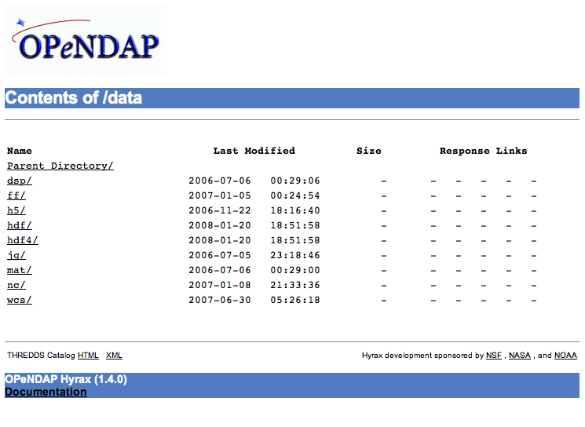

= Customizing Hyrax
:Leonard Porrello <lporrel@gmail.com>:
{docdate}
:numbered:
:toc:

== Introduction

There are several ways in which Hyrax can be customized:

* Web interface look and feel can be changed, as can the pages served.
* Custom DispatchHandlers for the OLFS
* Custom RequestHandlers for the BES.

== Webpage Customization

Hyrax's public "face" is the web pages that are produced by servlets
running in the Tomcat servlet engine. Almost all of these pages can be
completely customized by the site administrator by editing a combination
of HTML, XSLT, and CSS files.

=== Where To Make the Changes

All of the default versions of the HTML, XSLT, and CSS files come
bundled with Hyrax in the _$CATALINA_HOME/webapps/opendap/docs_
directory. You can make changes there, but installing new versions of
the OLFS software will overwrite your modifications.

However, if the _docs_ directory is copied (preserving its structure) to
_$CATALINA_HOME/content/opendap/_ (creating the directory
__$CATALINA_HOME/content/opendap/docs__), then Hyrax will serve the
files from the new location.

Warning::
  _Do NOT remove files from this new directory (Or the old one for that
  matter). Each file, in its location, is required by Hyrax. You can
  make changes to the files but you should not rename or remove them._

Nothing inside the _$CATALINA_HOME/content_ directory is (automatically)
changed when installing new versions of Hyrax.

*The rest of these instructions are written with the assumption that a
copy of the _docs_ directory has been made as described above.*

=== What to Change

==== HTML Files

The HTML files provide the static content of a Hyrax server.

[width="100%",cols="20%,20%,20%,20%,20%",]
|=======================================================================
|File |       |Location |       |Description

|*index.html* | |_$CATALINA_HOME/content/opendap/docs_ | |The
documentation web page for the top level of Hyrax. As shipped it
contains a description of Hyrax and links to documentation and funders.
The contents.html pages (aka the OPeNDAP directories) links to this
document. +
 +

|*error400.html* | |_$CATALINA_HOME/content/opendap/docs_ | |Contains
the default error page that Hyrax will return when the client request
generates a *Bad Request* error (Associated with an HTML status of
400) +
 +

|*error403.html* | |_$CATALINA_HOME/content/opendap/docs_ | |Contains
the default error page that Hyrax will return when the client request
generates a *Forbidden* error. (Associated with an HTML status of 403) +
 +

|*error404.html* | |_$CATALINA_HOME/content/opendap/docs_ | |Contains
the default error page that Hyrax will return when the client request
generates a *Not Found* error. (Associated with an HTML status of 404) +
 +

|*error500.html* | |_$CATALINA_HOME/content/opendap/docs_ | |Contains
the default error page that Hyrax will return when the client request
generates an **Internal Server Error**. (Associated with an HTML status
of 500) +
 +

|*error501.html* | |_$CATALINA_HOME/content/opendap/docs_ | |Contains
the default error page that Hyrax will return when the client request
generates an **Not Implemented**. (Associated with an HTML status of
501) +
 +

|*error502.html* | |_$CATALINA_HOME/content/opendap/docs_ | |Contains
the default error page that Hyrax will return when the client request
generates an **Bad Gateway**. (Associated with an HTML status of 502) +
 +
|=======================================================================

==== CSS Files

[width="100%",cols="20%,20%,20%,20%,20%",]
|=======================================================================
|File |       |Location |       |Description

|*contents.css* | |_$CATALINA_HOME/content/opendap/docs/css_ | |The
contents.css style sheet provides the default colors and fonts used in
the Hyrax site. It is referenced by all of the HTML and XSL files to
coordinate the visual aspects of the site. +
 +

|*thredds.css* | |_$CATALINA_HOME/content/opendap/docs/css_ | |The
thredds.css style sheet provides the default colors and fonts used by
the THREDDS component of Hyrax. +
 +
|=======================================================================

==== Image Files

There are a number of image files shipped with Hyrax. Simply replacing
key image files will allow you to customize the icons and logos
associated with the Hyrax server.

[width="100%",cols="20%,20%,20%,20%,20%",]
|=======================================================================
|File |       |Location |       |Description

|*logo.gif* | |_$CATALINA_HOME/content/opendap/docs/images_ | |Main Logo
for the directory view (produced by contents.css and contents.xsl)

|*favicon.ico* | |_$CATALINA_HOME/content/opendap/docs/images_ | |The
cute little icon preceding the URL in the address bar of your browser.
To be used, this file needs to be installed into Tomcat.

|*BadDapRequest.gif, BadGateway.png, +
 favicon.ico, folder.png, +
 forbidden.png, largeEarth.jpg, +
 logo.gif, nasa-logo.jpg, +
 noaa-logo.jpg, nsf-logo.png, +
 smallEarth.jpg, sml-folder.png, +
 superman.jpg* | |_$CATALINA_HOME/content/opendap/docs/images_ | |These
files are referenced by the default collection of web content files
(described above) that ship with Hyrax.
|=======================================================================

==== XSL Transform Files

These files are used to transform XML documents used by Hyrax. Some
transforms operate on source XML from internal documents such as BES
responses. Other transforms change things like THREDDS catalogs into
HTML for browsers.

_All of these XSLT files are software, and should be treated as such.
They are intimately tied to the functions of Hyrax. The likelihood that
you can change these files and not break Hyrax is fairly low._

===== Current Operational XSLT

[width="100%",cols="20%,20%,20%,20%,20%",]
|=======================================================================
|File |       |Location |       |Description

|*catalog.xsl* | |_$CATALINA_HOME/content/opendap/docs/xsl_ | |The
catalog.xsl file contains the XSLT transformation that is used to
transform BES showCatalog responses into THREDDS catalogs.

|*contents.xsl* | |_$CATALINA_HOME/content/opendap/docs/xsl_ | |The
contents.xsl file contains the XSLT transformation that is used to build
the
//*I am not sure what this link is referring to - ACP*
link:../index.php/ServerDispatchOperations#OPeNDAP_Directory_Response[OPeNDAP
Directory Response] (__see

 +

|*dap_3.2_ddxToRdfTriples.xsl* |
|_$CATALINA_HOME/content/opendap/docs/xsl_ | |_Experimental_ - This XSLT
is used to produce an RDF representation of a DAP 3.2 DDX.

|*dataset.xsl* | |_$CATALINA_HOME/content/opendap/docs/xsl_ | |This
transform is used to in conjunction with the opendap.threddsHandler code
to produce HTML pages of THREDDS catalog dataset element details.

|*error400.xsl* | |_$CATALINA_HOME/content/opendap/docs/xsl_ | |The
error400.xsl contains the XSLT transformation that is used to build the
web page that is returned when the server generates a Bad Request (400)
HTTP status code. If for some reason this page cannot be generated then
the HTML version (__$CATALINA_HOME/content/opendap/docs/error400.html__)
will be sent. +
 +

|*error500.xsl* | |_$CATALINA_HOME/content/opendap/docs/xsl_ | |The
error400.xsl contains the XSLT transformation that is used to build the
web page that is returned when the server generates a Internal Server
Error (500) HTTP status code. If for some reason this page cannot be
generated then the HTML version
(__$CATALINA_HOME/content/opendap/docs/error500.html__) will be sent. +
 +

|*thredds.xsl* | |_$CATALINA_HOME/content/opendap/docs/xsl_ | |This
transform is used to in conjunction with the opendap.threddsHandler code
to produce HTML pages of THREDDS catalog details.

|*version.xsl* | |_$CATALINA_HOME/content/opendap/docs/xsl_ | |This
transform is used to provide a single location for the Hyrax version
number shown in the public interface.
|=======================================================================

===== Experimental XSLT

[width="100%",cols="20%,20%,20%,20%,20%",]
|=======================================================================
|File |       |Location |       |Description

|*dapAttributePromoter.xsl* | |_$CATALINA_HOME/content/opendap/docs/xsl_
| |_Experimental_ - This XSLT file can be used to promote DAP Attributes
whose names contain a namespace prefix to XML elements of the same name
os the Attribute. _Not currently in use._

|*dapAttributesToXml.xsl* | |_$CATALINA_HOME/content/opendap/docs/xsl_ |
|_Experimental_ - This XSLT file might be used to promote DAP Attributes
encoded with special XML attributes to represent any XML to the XML the
Attribute was encoded to represent. _Not currently in use._

|*dap_2.0_ddxToRdfTriples.xsl* |
|_$CATALINA_HOME/content/opendap/docs/xsl_ | |_Experimental_ - This XSLT
can be used to produce an RDF representation of a DAP2 DDX. _Not
currently in use._

|*dap_3.3_ddxToRdfTriples.xsl* |
|_$CATALINA_HOME/content/opendap/docs/xsl_ | |_Experimental_ - This XSLT
can be used to produce an RDF representation of a DAP 3.3 DDX. _Not
currently in use._

|*namespaceFilter.xsl* | |_$CATALINA_HOME/content/opendap/docs/xsl_ |
|_Experimental_ - This XSLT can be used to filter documents so that only
elements in a particular namespace are returned. _Not currently in use._

|*wcs_coveragePage.xsl* | |_$CATALINA_HOME/content/opendap/docs/xsl_ |
|_Experimental_ - This XSLT is used by the prototype CEOP WCS gateway
client to produce an HTML page with coverage details. _Not currently in
use._

|*wcs_coveragesList.xsl* | |_$CATALINA_HOME/content/opendap/docs/xsl_ |
|_Experimental_ - This XSLT is used by the prototype CEOP WCS gateway
client to produce an HTML page with a list of available coverages. _Not
currently in use._

|*xmlToDapAttributes.xsl* | |_$CATALINA_HOME/content/opendap/docs/xsl_ |
|_Experimental_ - This XSLT can be used to covert any XML content into a
set of specially encoded DAP Attributes. The resulting Attribute
elements have XML _type_ attributes that are not currently recognized by
any OPeNDAP software. _Not currently in use._
|=======================================================================

== Software Customization

=== OLFS Customization

http://www.opendap.org/support/bom_sdw/SDW_2r0_OLFSExtensions.ppt[Power
Point Presentation From the 2007 Software Development Workshop hosted by
the Australian Bureau of Meteorology.]

=== BES Customization

http://www.opendap.org/support/bom_sdw/SDW_4r0_BESExtensibility.ppt[Power
Point Presentation From the 2007 Software Development Workshop hosted by
the Australian Bureau of Meteorology.]
