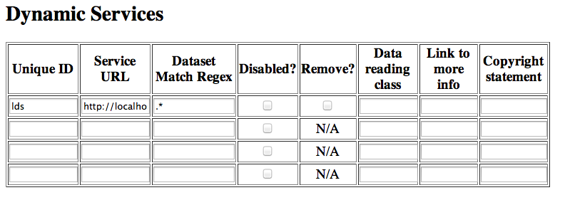

= Hyrax WCS Service
:James Gallagher <jgallagher@opendap.org>:
{docdate}
:numbered:
:toc:

== Overview

Hyrax includes an optional WCS, version 2, service that can be used to
access all of the geo-referenced data available to the server that
meet the requirements of the WCS 2 specification. This appendix
describes the the kinds of data that meet these requirements along
with the installation and configuration process of the optional WCS
service. 

== Theory of Operation

The operation of the WCS service is similar to that of the
xref:WMS_Service[WMS service] described elsewhere in this manual. The
WCS service provides access to data served using DAP through a Dynamic
Service Interface. The WCS service is configured to read data served
by a DAP server (e.g., a Hyrax server) and builds the WCS responses
dynamically by accessing the data from the DAP server as those WCS
responses are requested.

However, unlike the WMS service, the WCS is more tightly integrated
into the Hyrax server's data catalog pages. There is no separate WCS
catalog, per se, and instead the Hyrax catalogs' _viewers_ pages are
used to access the WCS service interface for a particular dataset.
This level of integration simplifies configuration.

Because the links used to access the WCS service are incorporated into
the web pages provided by Hyrax, the ability to easily reference data
from other servers is not made available in the software we provide
(although it the service could be configured that way if a new catalog
system were added).

The WCS service attempts to auto-configure data sets so that the data
provider need not learn all of the details of the WCS specifications.
However, to accommodate situations where the needed metadata cannot be
read from the dataset, the WCS service can read values from a
configuration file.

NOTE: The _Open Geospatial Consortium_ has many documents that
describe the concept of a _coverage_. The
link:http://www.opengeospatial.org/standards/wcs[suite of
specifications that describe WCS] can be found on their web site.

== Candidate Datasets

In order for the WCS service to work with a dataset served using DAP,
that dataset must contain one or more _coverages_, dataset variables
that meet fairly strict requirements for both strucurte and metadata.
To qualify as a WCS coverage, a variable in a dataset must satisfy the
following criteria:

* The variable must have an associated _Spatial Reference System_
  (SRS) that describes the organization of latitude and longitude for
  the variable. The SRS also provides geo-referencing information that
  enables analysis tools to account for irregularities in the Earth's
  geoid. In practice, Hyrax is often used with data that have global
  extent and so the SRS is _WGS84_ (aka _EPSG 4396_), and the current
  version of the WCS service uses that SRS by default.
  
* The variable's fastest varying dimensions (e.g., the right-most
  dimensions in most system's representations) must be axes defined by
  the SRS (i.e., longitude and latitude) and they must match the SRS's
  axis' order.

* Other dimentions of the variable (e.g., ensamble set) must be 'to
  the left' of the dimensions defined by the SRS.

* The SRS's axes define the _range_ of the coverage; the _domain_ of
  the coverage is value of the variable. This value must have an
  associated _unit of measure_.

WARNING: The above might be wrong and is probably missing stuff. If
so, fix; if not, remove this note.

== WCS Installation (suggested)

The WCS 2 Service web application is easy to install.

To add o the WCS 2 service to an running installtion of Hyrax, simply...

* Install and configure any version of Hyrax later than 1.13.5. See
  the link:https://www.opendap.org/software/hyrax-data-server[Hyrax
  download and installation page] and this guide for configuration
  information.

* Retrieve the latest stable release of the WCS 2 Service from
  link:https://www.opendap.org/software/hyrax-data-server[the Hyrax
  Server Release web page].

* Copy the WAR files _WCS-2.0.war_ into the _webapps_ directory of
  Tomcat (e.g., _/usr/share/tomcat/webaps_ if you are using the RPM
  package version of Tomcat on RedHat Linux, or more generally,
  _$CATALINA_HOME/webapps_) 

* Restart Tomcat

NOTE: While we don't test other servlet engines, users have reported
that our Web Archive files work with alternatives to Tomcat (e.g.,
GlassFish).

== Setting Dataset Fallback Values

Because WCS requires certain metadata to work (where as, DAP can
function with nothing more than a variable's name and type), our
service provides a way to user WCS with datasets that natively lack
the required WCS metadata. We do this using a pair of configuration
files. These files use a simple XML document combined with regular
expressions to establish default values for different groups of
datasets.

The configuration information is held in two different files, one that
defines a named set of default parameters for a group of files and one
that binds that set of parameters using the name) to a group of files
(using a regular expression). The first of these two files is
_wcs_service.xml_ which can be found in  _WCS-2.0/WEB-INF/conf/_ and is
shown below.

.wcs_service.xml
[source,xml,linenums]
----
<WcsService>
    <WcsCatalog className="opendap.wcs.v2_0.DynamicServiceCatalog" >
        <DynamicService name="tb13" href="http://localhost:8080/opendap/"> <!--1-->
            <DefaultSRS name="urn:ogc:def:crs:EPSG::4326"> <!--2-->
                <axisLabels>latitude longitude</axisLabels>
                <uomLabels>deg deg</uomLabels>
                <srsDimension>2</srsDimension>
            </DefaultSRS>
        </DynamicService>
    </WcsCatalog>
</WcsService>
----

<1> The _DynamicService_ definition, this links this information with the
dataset(s) describd in the _viewers.xml_ file that can be found in the
_opendap/WEB-INF/conf/_ directory.

<2> The _DefaultSRS_ element defines the axis labels, order, units and
number of dimensions for the SRS that will be used for any dataset
that does not contain an explicit SRS definition.

The second file is _viewers.xml_ found in the _opendap/WEB-INF/conf/_,
shown below.

.viewers.xml
[source,xml,linenums]
----
<ViewersConfig>
    ...
    <WebServiceHandler className="opendap.viewers.WcsService" serviceId="WCS-TB13" >
        <ApplicationName>Testbed-13 WCS Service</ApplicationName>
        <ServiceEndpoint>http://localhost:8080/WCS-2.0/</ServiceEndpoint>
        <DynamicServiceId>tb13</DynamicServiceId>	<!--1-->
       <MatchRegex>/testbed-13/.*</MatchRegex>	<!--2-->
     </WebServiceHandler>
    ...
</ViewersConfig>
----

<1> The _DynamicServiceId_ names a particular set of default SRS
values in the _wcs_service.xml_ file show above. In this example the
name _tb13_ in both documents connects the two sections. Note that the
element is called _DynamicService_ in the _wcs_service.xml_ file.

<2> This is the regular expression that defines the data that the
Service accesses. If datasets that match the regular expression
don't have the needed metadata, they will use the defaults from the
_tb13_ section of the _wcs_service.xml_ file.

WARNING: This is where I stopped editing.

=== Co-Configuration

The following sub sections assume that you have installed both Hyrax and
the ncWMS2 on your server in a single Tomcat instance running on port
8080. If your arrangement is different, you will need to adjust
accordingly.

For the following example sections we will use the following URLs:

* Your Tomcat server: http://servername.org:8080/
* Top level of DAP server: http://servername.org:8080/opendap
* Top Level of ncWMS2: http://servername.org:8080/ncWMS2
* WMS Service: http://servername.org:8080/ncWMS2/wms
* Godiva: http://servername.org:8080/ncWMS2/Godiva3.html

=== ncWMS2 configuration

==== Authenticate as the Administrator

In order to access the ncWMS2 administration page (which you must do in
oder to configure the server), you will need to configure authentication
and access control for the page, or you will need to temporarily disable
access control for the page in order to configure the server. (We strongly
recommend the former).

The default security configuration for ncWMS2 can be located (after
initial launch) in the file...

`$CATALINA_HOME/webapps/ncWMS2/WEB-INF/web.xml`

This configuration stipulates that access to the _ncWMS2/admin_ pages
must be over a secure transport and that there will be no access without
authentication  in the *`manager`* role:

[source,xml]
----
<!-- Define a Security Constraint on the Admin command and user interfaces -->
<security-constraint>
    <web-resource-collection>
        <web-resource-name>admin</web-resource-name>
        <url-pattern>/admin/*</url-pattern>
    </web-resource-collection>
 
    <auth-constraint>
        <role-name>manager</role-name>
    </auth-constraint>
 
    <user-data-constraint>
        <transport-guarantee>CONFIDENTIAL</transport-guarantee>
    </user-data-constraint>
</security-constraint>
----

.Your choices

.  *Use Apache httpd to provide authentication services for your
installation.*
..  Comment out the `security-constraint` in the `web.xml` file for
ncWMS2.
..  Correctly integrate Tomcat and Apache using the AJP connector.
..  Configure an Apache httpd `<Location>` directive for the
`ncWMS2/admin` page.
..  Write the directive to restrict access to specific users.

.  *Use Tomcat authentication.*
..  Leave the `security-constraint` in place.
..  Correctly configure Tomcat to use some type authentication (e.g.,
MemoryRealm).
..  Modify the `security-constraint` to reflect your authentication
configuration. (Different role? HTTPS? etc.)

.  *Temporarily Disable the `security-constraint`.*
..  Comment out the `security-constraint` in the `web.xml` file for
ncWMS2.
..  Finish the configuration steps below.
..  At the end, when it's working, go back and un-comment the
`security-constraint` in the web.xml file for ncWMS2.
..  Restart Tomcat.

Now that you can get to it, go to the ncWMS2 administration page:
http://servername.org:8080/ncWMS2/admin/

NOTE: Any changes you make to the `web.xml` are volatile!
Installing/Upgrading/Reinstalling the web archive (.war) file will
overwrite `web.xml` file. Make a back-up copy of the `web.xml` in a
different, more durable location.

==== Configure a Dynamic Service

Once you have authenticated and can view the ncWMS2 admin page, scroll
down to the Dynamic Services section:

Create a new Dynamic Service for Hyrax:

* Choose and enter a unique ID. (Using 'lds' will save you the trouble
of having to edit the olfs configuration viewers.xml file to adjust that
value.) Write down the string/name you use because you'll need it later.
* The value of the _Service URL_ field will be the URL for the top level
of the Hyrax server.
** If the Hyrax server and the ncWMS2 server are running together in a
single Tomcat instance then this URL *should* be expressed as:
http://localhost:8080/opendap
** If the Hyrax server and the ncWMS2 server are running on separate
systems this URL *must* be a DAP server top level URL, and not a
localhost URL.
** *Best WMS response performance will be achieved by running ncWMS2 and
Hyrax on the same server and providing the _localhost_ URL here.*
* The Dataset Match Regex should be a regex that matches of all of the
data files you have for which WMS can prove services. If that's too
cumbersome then just use '.*' (as in the example) which matches
everything.
* Scroll to the bottom of the page and save the configuration.

.Creating a Dynamic Services Entry for Hyrax in the ncWMS2 Admin Page
[width="100%",cols="16%,12%,12%,12%,12%,12%,12%,12%",options="header",]
|====
|Unique ID |Service URL |Dataset Match Regex |Disabled? |Remove |Data
Reading Class |Link to more info |Copyright Statement
|lds |http://localhost:8080/opendap |.* | | | | |
|====

=== Hyrax Configuration

The Hyrax WMS configuration is contained in the file
`$OLFS_CONFIG_DIR/viewers.xml`. This file identifies data viewers and
Web Services that Hyrax can provide for datasets. There are two relevant
sections, the first defines Hyrax's view of the WMS service and the
second enables Hyrax to provide access to the Godiva service that is
part of ncWMS.

Edit the file `$OLFS_CONFIG_DIR/viewers.xml`

Uncomment the following sections:
[source,xml]
----
<!--
    <WebServiceHandler className="opendap.viewers.NcWmsService" serviceId="ncWms" >
        <applicationName>Web Mapping Service</applicationName>
        <NcWmsService href="/ncWMS2/wms" base="/ncWMS2/wms" ncWmsDynamicServiceId="lds" />
    </WebServiceHandler>
 
    <WebServiceHandler className="opendap.viewers.GodivaWebService" serviceId="godiva" >
        <applicationName>Godiva WMS GUI</applicationName>
        <NcWmsService href="http://YourServersNameHere:8080/ncWMS2/wms" base="/ncWMS2/wms" ncWmsDynamicServiceId="lds"/>
        <Godiva href="/ncWMS2/Godiva3.html" base="/ncWMS2/Godiva3.html"/>
    </WebServiceHandler>
-->
----

=== NcWmsServce

In the first section...
[source,xml]
----
<WebServiceHandler className="opendap.viewers.NcWmsService" serviceId="ncWms" >
    <applicationName>Web Mapping Service</applicationName>
    <NcWmsService href="/ncWMS2/wms" base="/ncWMS2/wms" ncWmsDynamicServiceId="lds" />
</WebServiceHandler>
----

Edit the _NcWmsService_ element so that...

* The value of the _ncWmsDynamicServiceId_ matches the _Unique ID_ of
the Dynamic Service you defined in ncWMS.

NOTE: The _href_ and _base_ attributes both use relative URL paths to
locate the ncWMS service. If the ncWMS instance is NOT running on the
same host as Hyrax, the values of the _href_ and _base_ attributes
must be converted to fully qualified URLs.

== Issues

