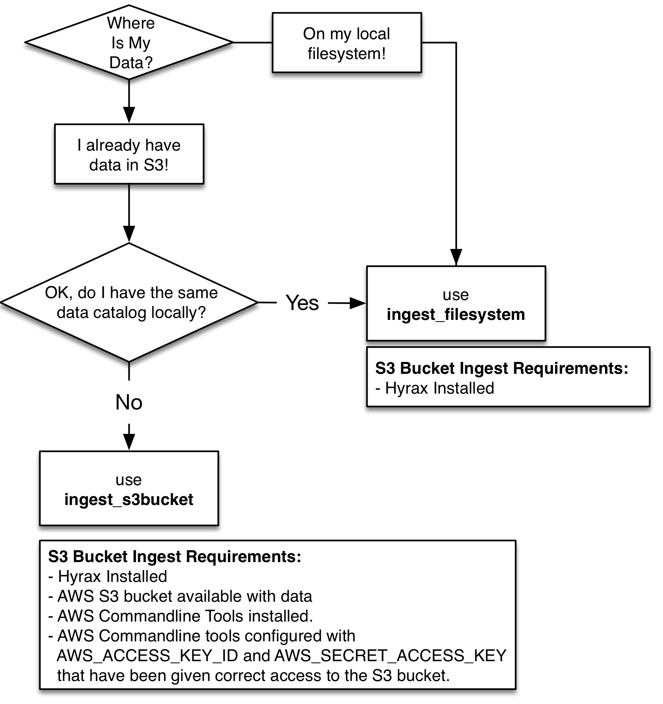

= Serving Remote Data with HDF5/NetCDF-4 and DMR++
:Nathan Potter <ndp@opendap.org>:
{docdate}
:numbered:
:toc:

== Overview
There are several ways that Hyrax can serve remotely located data. In this paper we discuss how to construct a Hyrax data system that utilizes Amazon's S3 service (or any HTTP service that supports the use of Range GET) in conjunction with local metadata held in `dmr++` files to create a system that provides quick access to data and that minimizes (for constrained DAP requests) the data egress volume from the HTTP service.

In this scheme the original data files are held in S3 (or any other HTTP service that supports Range GET) as objects. The metadata, along with access information about the S3 object, are held as `dmr++` files on the Hyrax platform.

Each `dmr\++` file needs to know the network location(s) of the objects(s) from which its data will be read. For some representations multiple objects may be used, but for these examples each `dmr++` will be associated with a single web accessible object (held in S3 for this example).

=== Process

Most of this process is about creating and organizing content for Hyrax.

1. Process the data to create the content - `dmr++` files
1. Place the `dmr++` files into a Hyrax server's data tree.
1. Making sure the S3 bucket URL is on the whitelist.
1. Restart Hyrax
1. w00t ftw


=== Portability and data catalog organization.
Once the `dmr\++` files are built they are "portable" in the sense that they can be arranged in any Hyrax server's "catalog" in any manner desired, as each `dmr++` file is self contained and includes a reference to the data objects HTTP service (S3 in this case) URL. However if the underlying data object is (re)moved then the `dmr++` file will become invalid.

=== Where are the source data?
Where the source data are located will dictate which program will be used to build the `dmr\++` files.
If the data are present on the local filesystem then the program *ingest_filesystem* is the best choice for building the `dmr++` files.
Even if the data are already in S3 (or some other HTTP service), if the data are also available on the local filesystem then we want to use *ingest_filesystem* to build the `dmr++` files.

If the data are only available in an S3 bucket then the program *ingest_s3bucket* can be used to build the `dmr++` files, which will be placed in the local filesystem.




== ingest_filesystem - for data in the local filesystem
When the data are held in the locally mounted filesystem we can use the program *ingest_filesystem* to construct the `dmr\++` files. It will crawl filesystem and make a DMR++ for every file whose path name matches the default (or user supplied) regex.

The `dmr++` is built using the DMR as returned by the HDF5 handler, using options as set in the bes configuration file used by *get_dmrpp*.

The options for *ingest_filesystem* are as follows:

 -h: Show help
 -v: Verbose: Print the DMR too
 -V: Very Verbose: Verbose plus so much more!
 -j: Just print the DMR that will be used to build the DMR++
 -u: The base endpoint URL for the DMR++ data objects. The assumption
     is that they will be organized the same way the source dataset
     files below the "data_root" (see -d)
     (default: https://s3.amazonaws.com/cloudydap)
 -d: The local filesystem root from which the data are to be ingested.
     The filesystem will be searched beginning at this point for files
     whose names match the dataset match regex (see -r).
     (default: "^.*\\.(h5|he5|nc4)(\\.bz2|\\.gz|\\.Z)?$")
 -t: The target directory for the dmrpp files. Below this point
     the organization of the data files vis-a-vis their "/" path
     separator divided names will be replicated and dmr++ files placed
     accordingly.
     (default: CWD)
 -r: The dataset match regex used to screen the base filesystem
     for datasets.
     (default: ${dataset_regex_match})
 -f: Use "find" to list all regular files below the data root directory
     and store the list in ./all_files.txt The the dataset match regex is applied
     to each line in ./all_files.txt and the corresponding data files list is
     placed in ./data_files.txt
     If this option is omitted the files named in ./data_files.txt (if any)
     will be processed.
     (default: Not Set)

=== Dependencies
*ingest_filesystem* requires that:

- The BES installation's bin directory (a.k.a. `$prefix/bin`) is on the PATH.

=== Example

```
ingest_filesystem -u https://s3.amazonaws.com/cloudydap -d /usr/share/hyrax/ -t ./dmrpp -f
```
- `-u https://s3.amazonaws.com/cloudydap` Use this URL as the base URL for each `dmr++` file.
- `-d /usr/share/hyrax/` Process all of the matching files starting at `/usr/share/hyrax`
- `-t ./dmrpp` Place the `dmr++` files into a directpry called `./dmrpp` in the CWD.
- `-f` Run a new search for matching files, don't rely on an existing list.


== ingest_s3bucket - for data in an S3 bucket

The program *ingest_s3bucket* can be used to build `dmr++` files from objects/files held in an AWS S3 bucket. Optionally, it can list the AWS S3 bucket to create an inventory list and then filter this list using the default (or user supplied) regex to create a list of target data files. Otherwise it can use an existing list of target data files. It will then iterate over the list of target data files and for each one:

- Retrieve the file from S3.
- Create the `dmr++` for the retrieved file.
- Delete the downloaded file (unless instructed not to).

The `dmr++` is built using the DMR as returned by the HDF5 handler, using options as set in the bes configuration file used by *get_dmrpp*.

The options for *ingest_s3bucket* are as follows:

 -h: Show help
 -v: Verbose: Print the DMR too
 -V: Very Verbose: Verbose plus so much more. Your eyes will water from
     the scanning of it all.
 -j: Just print the DMR that will be used to build the DMR++
 -s: The endpoint URL for the S3 datastore.
     (default: https://s3.amazonaws.com)
 -b: The S3 bucket name.
     (default: cloudydap)
 -d: The "local" filesystem root for the downloaded data.
     (default: ./s3_data/cloudydap})
 -t: The target directory for the dmrpp files. Below this point
     the structure of the bucket objects vis-a-vis their "/" path
     separator divided names will be replicted and dmr++ placed into
     it accordingly.
     (default: CWD)
 -f: Retrieve object list from S3 bucket into the list file for the bucket,
     apply the dataset match regex to the object names to create
     the data files list for the bucket. If this is omitted the files named
     in an existing, matching, bucket list file (if any) will be processed.
     (default: Not Set)
 -r: The dataset match regex used to screen the filenames
     for matching datasets.
     (default: "^.*\\.(h5|he5|nc4)(\\.bz2|\\.gz|\\.Z)?$")
 -k: Keep the downloaded datafiles after the dmr++ file has been
     created. Be careful! S3 buckets can be quite large!

=== Dependencies
*ingest_s3bucket* requires that:

- The BES installation's bin directory is on the PATH.
- The AWS Commandline Interface is installed and on the path.
- The AWS Commandline Interface has been configured for with an AWS `ACCESS_KEY_ID` and `AWS_SECRET_ACCESS_KEY` that have adequate permissions to access the target AWS S3 bucket.

=== Example

```
ingest_s3bucket -d ./tmp_data -b cloudydap -t ./dmrpp -f
```
- `-d ./tmp_data` Download the S3 data objects into a directory `./tmp_data` in the CWD.
- `-b cloudydap` Use the S3 bucket named `cloudydap`.
- `-t ./dmrpp` Place the `dmr++` files into a directpry called `./dmrpp` in the CWD.
- `-f` Run a new search for matching files, don't rely on an existing list.

== Copying Data To S3

If you have all your data on a local file system and it has not been loaded into S3 this can be easily accomplished using the AWS Command Line Interface (*CLI*).
If you are using an AWS EC2 system then it should be available through *yum* or *apt-get*. Otherwise, https://docs.aws.amazon.com/cli/latest/userguide/cli-chap-install.html[Detailed instructions may be found here]

Once installed you'll need to run the `aws configure` command to configure the installation with AWS `ACCESS_KEY_ID` and `AWS_SECRET_ACCESS_KEY` values that have adequate permissions to write data to the target AWS S3 bucket.

With this in place it's a simple matter to copy a single file to an S3 bucket:
```
aws s3 cp foo.txt s3://mybucket/foo.txt
```
Or an entire tree:
```
cd /usr/share/hyrax
aws s3 cp --recursive myDir s3://mybucket/
```
And you can even exclude certain files based on a match expression:
```
cd /usr/share/hyrax
aws s3 cp --recursive --exclude "*.jpg" myDir s3://mybucket/
```

== Appendix - Worker Bees

Both *ingest_filesystem* and *ingest_s3bucket* utilize the *get_dmrpp* program for constructing `dmr\++` content. In turn, the *get_dmrpp* program utilizes the *build_dmrpp* program to perform the `dmr++` construction activity. Some details on these two follow.

=== get_dmrpp

The *get_dmrpp* program writes the DMR++ for an hdf5_file to stdout

Both *ingest_filesystem* and *ingest_s3bucket* utilize the program *get_dmrpp* to build each `dmr++` file.

By default the BES Data Root directory is set to the CWD.
If no BES configuration is specified on the command line then an internally held
default configuration will be used. This utility will add an entry to the
bes.log specified in the BES configuration file. The DMR++ is built using the
DMR as returned by the HDF5 handler, using options as set in the bes
configuration file found here (ed: In the text of the *get_dmrpp* program.)

 -h: Show help
 -v: Verbose: Print the DMR too
 -V: Very Verbose: print the DMR, the command and the configuration
     file used to build the DMR
 -r: Just print the DMR that will be used to build the DMR++
 -u: The binary object URL for use in the DMR++ file
 -d: Data root directory for the BES.
 -o: The name of the file  to create.

 Limitations:
 * The pathname to the hdf5 file must be relative to the
   data root directory for the BES; absolute paths will not work.
 * The build_dmrpp command must be on the path.

==== Example
```
get_dmrpp -d /usr/shar/hyrax -u https://s3.amazonaws.com/cloudydap /slav/ATL04_20151028T061609_00970301_941_01.h5
```
- `-d /usr/shar/hyrax` Use `/usr/shar/hyrax` as the BES data root.
- `-u https://s3.amazonaws.com/cloudydap` Use this URL as the base URL for the `dmr++` creation.
- `/slav/ATL04_20151028T061609_00970301_941_01.h5` Build a `dmr++` for this file, `/slav/ATL04_20151028T061609_00970301_941_01.h5`.

The BES data root and the file name are combined by the BES. So the actuall instruction here is to make a `dmr++` file from `/usr/shar/hyrax/slav/ATL04_20151028T061609_00970301_941_01.h5`

=== build_dmrpp

The program *build_dmrpp* is a `C\++` program that utilizes the BES code base and the HDF5 library to interrogate an HDF5 file and build a `dmr++` from it.

---
`build_dmrpp [-v] -c <bes.conf> -f <data file>  [-u <href url>]`

- `-v` Verbose ouput (optional)
- `-c <bes.conf>` Supplies the name of the bes.conf file to utilize.
- `-f <data_file>` Read data from `<data_file>`
- `-u <href url>` The remote URL for the binary oject to reference in the `dmr++` file. (optional)

---
`build_dmrpp -f <data file> -r <dmr file>`

- `-f <data_file>` Read data from `<data_file>`
- `-r <dmr file>` Write only the DMR (not the `dmr++`) to `<dmr file>`

---
`build_dmrpp -h`

- `-h` Show usage

---
*Limitations:*

 * The pathname to the hdf5 file must be relative to the
   data root directory for the BES; absolute paths will not work.
