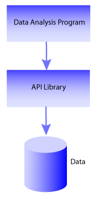
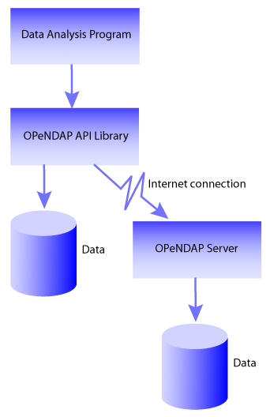
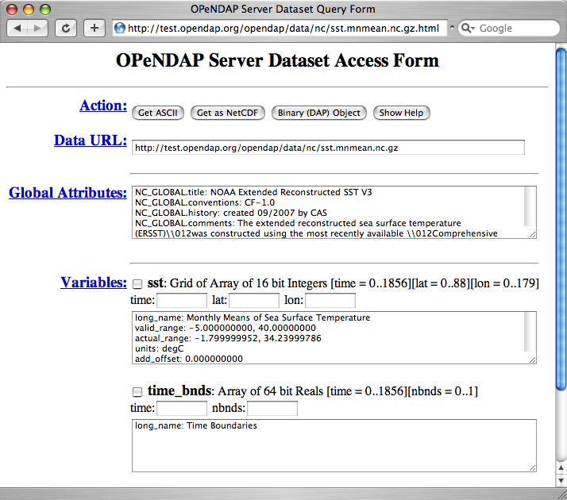
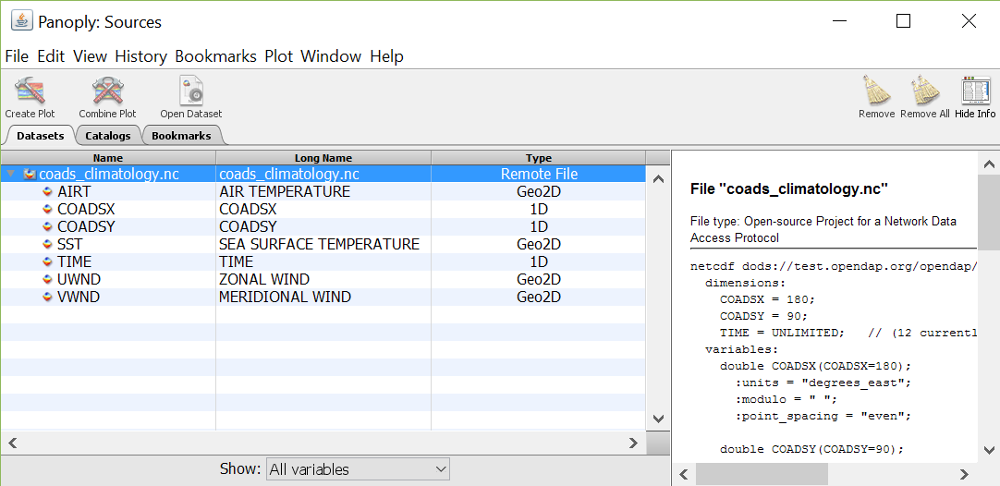
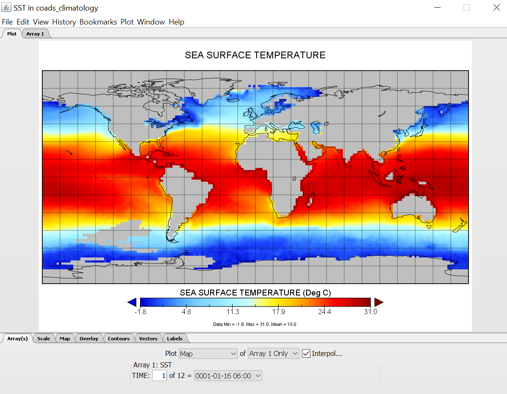

= User Guide - OPeNDAP Documentation
:Leonard Porrello <lporrel@gmail.com>:
2016-12-31
:numbered:
:toc:

// If there are lots of links we sneed to share, put their variables
// in a file and include it as in 'include link_variables.txt'

:quick-start-doc: QuickStart.html

:hyrax-doc: http://docs.opendap.org/index.php/Hyrax
:hyrax-bes-conf-doc: http://docs.opendap.org/index.php/Hyrax_-_BES_Configuration
:hyrax-olfs-conf-doc: http://docs.opendap.org/index.php/Hyrax_-_OLFS_Configuration
:hyrax-thredds-conf-doc: http://docs.opendap.org/index.php/Hyrax_-_THREDDS_Configuration
:hyrax-multi-bes-doc: http://docs.opendap.org/index.php/Hyrax_-_Configuring_The_OLFS_To_Work_With_Multiple_BES%27s
:libdap-doc: http://docs.opendap.org/index.php/Libdap

== About This Guide == 

This guide introduces important concepts behind the OPeNDAP data
model and Web API as well as the clients and servers that
use them. While it is not a reference for any particular client or server, you will find links to particular clients and servers in it.

== What is OPeNDAP ==

OPeNDAP provides a way for researchers to access scientific data
anywhere on the Internet, from a wide variety of new _and existing_
programs.

It is used widely in earth-science research settings but it is not limited to that. Using a flexible data model and a well-defined transmission format, an OPeNDAP client can request data from a wide variety of OPeNDAP servers, allowing researchers to enjoy flexibility similar to the flexibility of the web.

NOTE: There are different implementations of OPeNDAP produced by various open source organizations. This guide covers the implementation of OPeNDAP produced by the OPeNDAP group.

The OPeNDAP architecture uses a client/server model, with a _client_
that sends requests for data out onto the network to a _server_,
that answers with the requested data. This is the same model used by
the http://www.w3.org/hypertext/WWW/TheProject.html[World Wide Web]
where client browsers submit requests to web servers for the data that
compose web pages. Using flexible, general-purpose data types,
that can easily represent scientific data, OPeNDAP servers deliver real data
directly to client programs in the format needed by that client. In addition to the OPeNDAP data encoding, our server can return data in the following formats: NetCDF, GeoTIFF, JPEG2000, JSON, ASCII.
// replaced with the above. jhrg
// OPeNDAP can return data in the following formats: NetCDF, GeoTIFF, JPEG2000, JSON, // ASCII.

OPeNDAP clients are very specialized browsers, constructed by linking
new or existing data analysis programs with OPeNDAP-enabled versions
of the data
// legacy --> new or existing. jhrg
access APIs they use or by modifying programs to use one of the
OPeNDAP data access APIs. In addition to providing a sophisticated set
of network-compatible APIs in several languages, there are also
libraries of legacy APIs available in OPeNDAP-aware versions. The
popular http://www.unidata.ucar.edu/downloads/netcdf/index.jsp[NetCDF]
library, for example, can read data from remote OPeNDAP data sources as
easily as it reads from a local file.
// The preceding is not exactly true - there is only the netCDF
// 'legacy' API that has been 'opendap enabled'. We planned for more,
// but they were seen as of little use. There are libraries in several
// programming languages (C/C++, Java, Python, JavaScript are the ones
// I know about). jhrg

To expand the universe of data available to a user, OPeNDAP incorporates
a powerful data translation facility, so that data may be stored in data
structures and formats that are defined by the data provider but can be accessed by the
users just like they access of local data files on the
user's own system. Although there are limitations on the types of data
that may be translated (see
xref:Translation[Translating Data Models] in this guide), the facility is flexible and general enough to handle many translations. The upshot of this is... 

* A user may not need to know that data from one set are stored in a
format different from data in another set. Also, it may be possible
that _neither_ data set is stored in a format readable by the original
version of the data analysis and display program he or she uses.
* No segment of OPeNDAP users will be cut off from accessing
data because of its storage format. A scientist who wants to make his
or her data available to other OPeNDAP users may do so while keeping
that data in what may be even a highly idiosyncratic storage format.

The combination of the OPeNDAP network communication model and the data
translation facility make OPeNDAP a powerful tool for the retrieval,
sampling, and display of large distributed datasets. Although OPeNDAP was
developed by oceanographers, its application is not limited to
oceanographic data. The organizing principles and algorithms may be
applied to many other fields.

The uniformity with which data appears, which makes the system useful
for data analysis, also enables you to automate data transport and manipulation
tasks. For example, NOAA's
http://ferret.pmel.noaa.gov/Ferret/LAS/home/[Live Access Server (LAS)]
(for example, http://mynasadata.larc.nasa.gov/data.html) uses
OPeNDAP, as do many of the real-time observing systems that make up the
https://ioos.noaa.gov/[Integrated Ocean Observing System (IOOS)], such as the
http://gomoos.org[Gulf of Maine Ocean Observing System (GoMOOS)].

Users who may be interested in OPeNDAP may be divided into data consumers and data providers (and these two roles are often assumed by the same scientists). The remainder of this guide is organized around this distinction between classes of users.

=== The OPeNDAP Client/Server ===

OPeNDAP uses a client/server model. The OPeNDAP servers are web servers
equipped to interpret an OPeNDAP URL sent to them. An OPeNDAP client
composes and sends messages to those servers. There are standalone
OPeNDAP clients, but most clients are constructed from data analysis
programs that are modified to get their data remotely, from the internet, rather
than locally, from a file.

Without OPeNDAP, a program that uses one of the common data
access APIs (such as NetCDF) operates as shown in
The Architecture of a Data Analysis Package figure, shown below. Here is how it works:
The user makes a request for data from the program; the program uses a
data access API to read and write data; the program uses procedures
defined by that API to access the data, which is typically stored on the
same host machine. Some APIs are somewhat more sophisticated than this, but their general operation is similar.

.The Architecture of a Data Analysis Package

The operation of an OPeNDAP client is illustrated in the The Architecture of a Data Analysis Package Using OPeNDAP figure, shown below. Here, the _same program_ that was used in The Architecture of a Data Analysis Package
figure (above) has been modified to use one of the OPeNDAP API libraries.
Now, in addition to being able to use local data as before, the program is able to access data from OPeNDAP servers anywhere on the internet just as it would local data.

To make any analysis program into an OPeNDAP client, it just needs to be linked with the OPeNDAP API library. (Or, if your program uses one of the
supported legacy API libraries, like NetCDF, you can link with the
OPeNDAP version of that library.) This will create a program that
accepts URLs as well as file pathnames to identify needed data. (See xref:OPeNDAP_Client[OPeNDAP Client] in this guide).

.The Architecture of a Data Analysis Package Using OPeNDAP

OPeNDAP also provides data translation functionality. Data from the
original data file is translated by the OPeNDAP server into the OPeNDAP
data model for transmission to the client. Upon receiving the data, the
client translates the data into the
xref:OPeNDAP_Data_Model[Data Model] it understands. Because
the data transmitted from an OPeNDAP server to the client travel in the
OPeNDAP format, the dataset's original storage format is completely
irrelevant to the client. For example, if the client was originally designed to read
NetCDF format files, the data returned by the OPeNDAP-enabled NetCDF library
will appear to have been read from a NetCDF file. Similarly, if the program uses C, Python, Java or JavaScript there are OPeNDAP API libraries that will enable it to directly access data. Finally, if a program can read data from files using any of the server's supported format, it is easy to use the OPeNDAP server to send you data in a file and use that just like any other local data file. 
// Replaced with the above. jhrg
// expects JGOFS data, the OPeNDAP-JGOFS library will return data that seem to have // come from a JGOFS dataset, and so on.

OPeNDAP does not claim to remove all of the overhead of data searches. A
user will still have to keep track of the URLs of interesting data in
the same way a user must now keep track of the names of files. (You may
run across datasets where the data consists of OPeNDAP URLs. These are
the OPeNDAP file servers and have been developed by OPeNDAP users to
organize datasets consisting of large numbers of individual files.) But
OPeNDAP does make the access to that data simpler and quicker.

The OPeNDAP group provides a whole array of client software to implement
this communication standard. These range from standalone clients to
libraries to link with existing software. In addition, a community of like-minded software developers and data users has built compatible software that extends the software we offer in many new directions.
// I hacked this a bit to reflect new developments since this was written. jhrg

=== OPeNDAP Services ===

The communication between an OPeNDAP client and server is specified by
the xref:DAP[DAP]. This defines the range of messages a
server must understand and the kinds of replies it makes.

There are two categories of messages that an OPeNDAP server can understand.
Some are required by the DAP and others are merely suggested. A server
is considered to be DAP-compliant if it can respond intelligibly to the
required messages. Following are the requests messages a server is required to understand:

Data Description:: Data values come in types and sizes. An array, for example, might consist of 10 integers. The value "ten" and the type "integer" describe the array. This request returns information about data types, so that a receiving program can allocate space appropriately. See xref:DDS[Data Description Structure (DDS)] in this guide.

Data Attribute:: This is a request to provide information _about_ data and typically includes information like units, names of data types, reference information and so on. See xref:DAS[Data Attribute Structure (DAS)] in this guide.

Data:: The server also must be able to respond to a request for the data itself. See xref:DDS[Data Description Structure (DDS)] in this guide.

In addition, a server may respond to requests like these:

ASCII:: Some servers can convert data to ASCII values on the fly. This allows users to view data using a standard web browser, assuming the data are not too large. See xref:ASCII_Service[ASCII Service] in this guide.

Info:: The info response is a formatted page containing information from the Data Attributes and Data Description responses. It is meant to be a human-readable means to show what is available in a dataset via a standard web browser. See xref:Info_Service[Info Service] in this guide.

HTML:: Very similar to the info response, the HTML response provides the information from the info response and also includes a JavaScript form to help you build a request for data from the same data file. The best description of the HTML form is in the link:{quick-start-doc}[Quick Start Guide].

SOAP:: OPeNDAP servers can provide their data in terms of a SOAP request and response. For more information see xref:SOAP[SOAP] in this guide.
// FIXME SOAP is deprecated in our server, but the binding is probably technically
// valid. How should we handle this? Remove it from the guide and leave it as
// a developer item or leave it here but add an explanation about it's current
// support in/by our server? jhrg

DDX:: The DDX is an XML version of the Data Attribute and Data Description replies. See xref:DDX[DDX] in this guide.

// FIXME We need to add information about DAP4 here and thus to introduce the 
// idea that there are two DAP protocol versions. jhrg
// Also, there are a number of other responses the our server supports, we should
// be clear about these (that they exist, but some are probably not _suggested_).
// jhrg

=== The OPeNDAP Server (Hyrax) ===

OPeNDAP provides a definition of the communication between client and
server and enables servers and clients that conform to xref:DAP[DAP] standard to communicate
with each other. In addition to the DAP communication standard
itself, the OPeNDAP group also provides an implementation of a
standard server protocol, called _Hyrax.
// (_Hyrax_ is an alternative name for the OPeNDAP 4 Data Server.) jhrg

For most data consumers, the architecture of Hyrax is not important
since they see only its web interface (through a browser or by pasting
URLs into an application). Hyrax is actually made up of two pieces. You can think of them 
as a front-end and a back-end, though a client will not be aware of the
separation. They will often be run on the same machine, and even when
they are not, a client will see only the front end.
// I modified this paragraph a bit because most people don't need to
// know how the server is deployed. jhrg

** The front-end server is a Tomcat servlet and is also called the
*OPeNDAP Lightweight Front-End Servlet* (OLFS). Its job is to receive
your request for data and manage all the different forms a request
might take. For example, you might be asking for the data, an ASCII
version of the data, or a reply to a SOAP message looking for data. The
front-end server can also reply to THREDDS catalog requests, for
information about the data, and can directly provide some information
about the data, too.

** The *Back-End Server* (BES) is more strictly about performance and is
designed to respond quickly and efficiently to requests from the OLFS.
It is a pure data server and has only one format of request and
response, relying on the OLFS to convert messages to whatever format
the user needs.
// FIXME. Not really true. 

NOTE: Most users will not make requests directly to the BES.

See xref:OPeNDAP_Data_Model[Data Model] in this guide for a description
of the data returned by requests and see
xref:OPeNDAP_Server[OPeNDAP Server] in this guide for a description of
the URL syntax used to send requests.

Go to the link:{hyrax-doc}[OPeNDAP 4 Data Server documentation] for
a description of how to install and configure an OPeNDAP data server
("Hyrax").

=== Administration and Centralization of Data ===

Under OPeNDAP, there is no central archive of data. Data under OPeNDAP
is organized similar to the World Wide Web. To make your data accessable, all that you need to do is to start up a properly
configured server on an Internet node that has access to the data to be
served. Data providers are free to join and to leave the system as doing so is convenient, just as any proprietor of a web page is free to delete it or add to it as needed.

Similar to the World Wide Web, there are some
disadvantages to the lack of central authority. If no one knows about a
web site, no one will visit it. Similarly, listing a dataset in a
central data catalog, such as the link:http://gcmd.nasa.gov/[Global Change Master Directory], can make data available to other researchers in a way that simply configuring an OPeNDAP server would not. You can contact the GCMD and submit 
your server to their catalog.
// Replaced this with the above. jhrg
// OPeNDAP provided a facility for registering a
// data set with the GCMD catalog. This makes the data set known to the
// OPeNDAP data location service. The THREDDS catalog service is another
// way to make information about your data widely available.

The remainder of this section will be divided into three sections:

** Instructions on the building and operating of OPeNDAP clients
** A tutorial and reference on running OPeNDAP servers and making data
available to OPeNDAP clients
** A technical documentation describing the
implementation details (and the motivation behind many of the design
decisions) of the OPeNDAP software.

[[OPeNDAP_Data_Model]]  
== OPeNDAP Data Model ==

This section provides a review of the data types OPeNDAP sends between
client and server and issues involved in translating one to another.
This information may be useful to researchers who will be using
OPeNDAP to transfer data.

// FIXME We will need to introduce the idea that there are now two DAP
// protocols - DAP2 (described in the text that follows now) and DAP4
// (not yet described in this document). They are pretty colsely
// related, but still there are differences. jhrg

// FIXME We should include links to the more technical (and
// authoritative) documents for DAP2 and DAP4. jhrg

=== Data and Data Models ===

Basic to the operation of OPeNDAP is its data model and the set of
messages that define the communication between client and server. This
section presents the data model (the next section presents the messages).

==== Data Models ====

Any data set is made up of data and a data model. The data model defines
the type and arrangement of data values and may be thought of as an
abstract representation of the relationship between one data value and
another. Although it may seem paradoxical, it is precisely this
relationship that defines the meaning of a number. Without the
context provided by a data model, a number does not represent anything.
For example, within some data set, it may be apparent that a number
represents the value of temperature at some point in space and time.
Without its neighboring temperature measurements, and without the
latitude, longitude, height (or depth), and time, the same number is meaningless.

As the model only defines an abstract set of relationships, two data
sets containing different data may share the same data model. For
example, the data produced by two different measurements with the same
instrument will use the same data model, though the values of the data
are different. Sometimes two models may be equivalent. For example, an
XBT (eXpendable BathyThermograph) measures a time series of temperature
near the surface of the ocean, but is usually stored as a series of
temperature and depth measurements. The temperature vs. time model of
the original data is equivalent to the temperature vs. depth model of
the stored data.

In a computational sense, a data model may be considered to be the data
type or collection of data types used to represent that data. A
temperature measurement might occur as half an entry in a sequence of
temperature and depth pairs. However the data model also includes the
scalar latitude, longitude, and date that identify the time and place
where the temperature measurements were taken. Thus the data set might
be represented in a C-like syntax like this:

.Example Data Description of XBT Station
--------------------------
Dataset {
   Float64 lat;
   Float64 lon;
   Int32 minutes;
   Int32 day;
   Int32 year;
   Sequence {
      Float64 depth;
      Float64 temperature;
   } cast;
} xbt-station;
--------------------------

The above example describes a data set that contains all the data from
a single XBT. The data set is called xbt-station and contains
floating-point representations of the latitude and longitude of the
station and three integers that specify _when_ the XBT measurements
were made. The xbt-station contains a single sequence (called cast) of
measurements, which are represented here as values for depth and temperature.

A slightly different data model representing the same data might look like this:

.Example Data Description of XBT Station Using Structures
--------------------------
Dataset {
   Structure {
      Float64 lat;
      Float64 lon;
   } location;
   Structure {
      Int32 minutes;
      Int32 day;
      Int32 year;
   } time;
   Sequence {
      Float64 depth;
      Float64 temperature;
   } cast;
} xbt-station;
--------------------------

In this example, some of the data have been grouped, implying a
relation between them. The nature of the relationship is not defined,
but it is clear that lat and lon are both components of location and
that each measurement in the cast sequence is made up of depth and temperature values.

In these two examples, meaning was added to the data set only by
providing a more refined context for the data values. No other data was
added, but the second example can be said to contain more
information than the first one.

These two examples are refinements of the same basic arrangement of
data. However, there is nothing that says that a completely different
data model can not be just as useful or just as accurate. For example, the
depth and temperature data, instead of being represented by a sequence
of pairs could be represented by a pair of sequences or arrays:

.Example Data Description of XBT Station Using Arrays
----------------------------
Dataset {
   Structure {
      Float64 lat;
      Float64 lon;
   } location;
   Structure {
      Int32 minutes;
      Int32 day;
      Int32 year;
   } time;
   Float64 depth[500];
   Float64 temperature[500];
} xbt-station;
----------------------------

The relationship between the depth and temperature variables is no
longer quite as clear, but depending on what sort of processing is
intended, the loss may be unimportant.

The choice of a computational data model to contain a data set
depends in many cases on the whims and preferences of the user as well
as on the data analysis software to be used. Several different data
models may be equally useful for a given task and not all data models will contain the same quantity of informaiton.

Note that with a carefully chosen set of data type constructors, such as
those we have  used in the preceding examples, a user can implement an
infinite number of data models. The examples above use the OPeNDAP xref:DDS[DDS] format, which will become important
in later discussions of the details of the OPeNDAP xref:DAP[DAP].
The precise details of the DDS syntax are described in the xref:DDS[DDS section] of this guide.

===== Data Models and APIs =====

A data access Application Program Interface (API) is a library of
functions designed to be used by a computer program to read, write, and
sample data. Any given data access API can be said to implicitly define a data model. (Or, at least, it will define restrictions on the data model.) That is, the functions that compose the API accept and return data using a certain collection of computational data types: multi-dimensional arrays might be required for some data, scalars for
others, and sequences for others. This collection of data types and their
use constitute the data model represented by that API. (Or data
models—there is no reason an API cannot accommodate several different
models.)

[[Translation]]
===== Translating Data Models =====

The problem of data model translation is central to the implementation
of OPeNDAP. With an effective data translator, an OPeNDAP program
originally designed to read netCDF data can have some access to data
sets that use an incompatible data model, such as an SQL database.
// Replaced 'JGOFS.' with SQL... jhrg

In general, it is not possible to define an algorithm that will
translate data from any model to any other model without losing information
defined by the position of data values or the relations between them.
Some of these incompatibilities are obvious. For example, a data model designed for
time series data may not be able to accommodate multi-dimensional
arrays. Others are more subtle. For example, a Sequence looks very
similar to a collection of Arrays in many respects, but this does not
mean they can always be translated from one to the other. For example,
some APIs return only one Sequence "instance" at a time. This means that
even if a Sequence of sets of three numbers is more or less the same
shape as three parallel Arrays, it will be very difficult to model the
one kind of behavior on the other kind of API.

However, even though the general problem is not solvable, there are many
useful translations that can be done and there are many others that are
still useful despite their inherent information loss.

For example, consider a relational structure below, which contains two nested
Sequences. The outer sequence represents all the XBT drops in a cruise; the inner sequence represents each XBT drop.

.Example Data Description of XBT Cruise
-----------------------------
Dataset {
   Sequence {
      Int32 id;
      Float64 latitude;
      Float64 longitude;
      Sequence {
         Float64 depth;
         Float64 temperature;
      } xbt_drop;
   } station;
} cruise;
-----------------------------

Note that each entry in the cruise sequence is composed of a tuple of
data values (one of which is itself a sequence). Were we to arrange
these data values as a table, they might look like this:

----------------------------
id   lat   lon   depth  temp
1   10.8   60.8    0     70
                  10     46
                  20     34
2   11.2   61.0    0     71
                  10     45
                  20     34
3   11.6   61.2    0     69
                  10     47
                  20     34 
----------------------------

This can be made into an array, although doing so introduces redundancy:

----------------------------
id   lat   lon   depth  temp
1   10.8   60.8    0     70
1   10.8   60.8   10     46
1   10.8   60.8   20     34
2   11.2   61.0    0     71
2   11.2   61.0   10     45
2   11.2   61.0   20     34
3   11.6   61.2    0     69
3   11.6   61.2   10     47
3   11.6   61.2   20     34
----------------------------

The data is now in a form that may be read by an API such as netCDF. However, 
consider the analysis stage. Suppose a user wants to see graphs of each
station's data. It is not obvious simply from the arrangement of the
array where one station stops and the next one begins. Analyzing data in
this format is not a function likely to be accommodated by a program
that uses the netCDF API, even though it is theoretically possible to
implement.

[[DAP]]
==== Data Access Protocol (DAP) ====

The OPeNDAP DAP defines how an OPeNDAP client and
an OPeNDAP server communicate with one another to pass data from the
server to the client. The job of the functions in the OPeNDAP client
library is to translate data from the DAP into the form expected by the
data access API for which the OPeNDAP library is substituting. The job
of an OPeNDAP server is to translate data stored on a disk (in whatever
format they happen to be stored in) to the DAP for transmission to the
client.

.DAP Components
The DAP consists of several components:

. An "intermediate data representation" for data sets. This is used to
transport data from the remote source to the client. The data types that
make up this representation may be thought of as the OPeNDAP data model.
. A format for the "ancillary data" needed to translate a data set
into the intermediate representation and to translate the intermediate
representation into the target data model. The ancillary data in turn
consists of two pieces:
* A description of the shape and size of the various data types stored
in some given data set. This is called the (xref:DDS[DDS]).
* Capsule descriptions of some of the properties of the data stored in
some given data set. This is called the xref:DAS[DAS].
. A "procedure" for retrieving data and ancillary data from remote
platforms.
. An "API" consisting of OPeNDAP classes and data access calls
designed to implement the protocol,

The intermediate data representation and the ancillary data formats are
introduced in the xref:OPeNDAP_Messages[OPeNDAP
Messages] section of this guide, as are the steps of the procedure. The actual details of the
software used to implement these formats and procedures is a subject of
the documentation of the respective software.

==== Data Representation ====

There are many popular data storage formats, and many more than that in
use. When these formats are optimized, they are optimized for data
storage and are not generally suitable for data transmission. In order
to transmit data over the Internet, OPeNDAP must translate the data
model used by a particular storage format into the data model used for
transmission.

If the data model for transmission is defined to be general enough to
encompass the abstractions of several data models for storage, then this
intermediate representation—the transmission format—can be used to
translate between one data model and another.

The OPeNDAP data model consists of a fairly elementary set of base
types combined with an advanced set of constructs and operators that
allows it to define data types of arbitrary complexity. This way, the
OPeNDAP data access protocol can be used to transmit data from virtually
any data storage format.

.OPeNDAP Elements

OPeNDAP comprises the following elements:

Base Types:: These are the simple data types, like integers, floating point
  numbers, strings, and character data.
Constructor:: Types These are the more complex data types that can be constructed
  from the simple base types. Examples are structures, sequences,
  arrays, and grids.
Operators:: Access to data can be operationally defined with operators defined on the various data types.
External Data Representation:: In order to transmit the data across the Internet, there needs to be a machine-independent definition of what the various data types look like. For example, the client and server need to agree on the most significant digit of a particular byte in the message

These elements are defined in greater detail in the sections that follow.

===== Base Types =====

The OPeNDAP data model uses the concepts of variables and operators.
Each data set is defined by a set of one or more variables, and each
variable is defined by a set of attributes. A variable's
_attributes_—such as units, name and type—must not be confused with
the data _value_ (or values) that may be represented by that variable. A
variable called _time_ may contain an integer number of minutes, but it
does not contain a particular number of minutes until a context, such as
a specific event recorded in a data set, is provided. Each variable may
further be the object of an operator that defines a subset of the
available data set.

Variables in the xref:DAP[DAP] have two forms. They are either base types or type
constructors. Base type variables are similar to predefined variables in
procedural programming languages like C or Fortran (such as int or
integer*4). While these have an internal structure, it is not
possible to access parts of that structure using the DAP. Base type
variables in the DAP have two predefined attributes (or
characteristics): name and type. They are defined as follows:

Name:: A unique identifier that can be used to reference the part of the
  dataset associated with this variable.
Type:: The data type contained by the variable. Data types include the following:

* Byte is a single byte of data. This is the same as unsigned char in
ANSI C.
* Int16 is a 16 bit two's complement integer. This is synonymous with long
in ANSI C when that type is implemented as 16 bits.
* UInt16 is a 16 bit unsigned integer.
* Int32 is a 32 bit two's complement integer. This is synonymous with long
in ANSI C when that type is implemented as 32 bits.
* UInt32 is a 32 bit unsigned integer.
* Float32 is the IEEE 32 bit floating point data type.
* Float64 is the IEEE 64 bit floating point data type.
* String is a sequence of bytes terminated by a null character.
* Url is a string containing an OPeNDAP URL.

The declaration in a
xref:DDS[DDS] of a variable of any of the base types is simply the type of the
variable followed by its name and a semicolon. For example, to declare
a month variable to be a 32-bit integer, you would type...

------------
Int32 month;
------------

===== Constructor Types =====

Constructor types, such as arrays and structures, describe the grouping
of one or more variables within a dataset. These classes are used to
describe different types of relations between the variables that
comprise the dataset. For example, an array might indicate that the
variables grouped are all measurements of the same quantity with some
spatial relation to one another, whereas a structure might indicate a
grouping of measurements of disparate quantities that happened at the
same place and time.

There are six classes of type constructor variables defined by 
OPeNDAP: arrays, structures, sequences, functions, and grids. These are explained below.

.Array
An array is a one dimensional indexed data structure as defined by ANSI
C. Multidimensional arrays are defined as arrays of arrays. An array may
be subsampled using subscripts or ranges of subscripts enclosed in
brackets ([]). For example, temp[3][4] would indicate the value in the
fourth row and fifth column of the temp array. (As in C, OPeNDAP array
indices start at zero.)

A chunk of an array may be specified with subscript ranges; the array
temp[2:10][3:4] indicates an array of nine rows and two columns whose
values have been lifted intact from the larger temp array.
 
NOTE: A _hyperslab_ may be selected from an array with a _stride_ value. The
array represented by temp[2:2:10][3:4] would have only five rows; the
middle value in the first subscript range indicates that the output
array values are to be selected from alternate input array rows. The
array temp[2:3:10][3:4] would select from every third row, and so on.

A xref:DDS[DDS] declaration of a 5x6 array of floating point numbers would look like this:

-------------------
Float64 data[5][6];
-------------------

In addition to its magnitude, every dimension of an array may also have
a name. The previous declaration could be written as...

------------------------------------
Float64 data[height = 5][width = 6];
------------------------------------

.Structure
A Structure is a class that may contain several variables of different
classes. However, though it implies that its member variables are
related somehow, it conveys no relational information about them. The
structure type can also be used to group a set of unrelated variables
together into a single dataset. The "dataset" class name is a synonym
for structure.

A xref:DDS[DDS] Structure declaration containing some data and the month in which the
data was taken might look like this:

-------------------------
   Structure {
      Int32 month;
      Float64 data[5][6];
   } measurement;
-------------------------

Use the *.* operator to refer to members of a Structure. For example,
measurement.month would identify the integer member of the Structure
defined in the above declaration.

.Sequence
A Sequence is an ordered set of variables, each of which may have several
values. The variables may be of different classes. Each element of a
Sequence consists of a value for each member variable, so a Sequence is
sort of like an ordered set of Structures.

Thus a Sequence can be represented as...

[cols=",,,",]
|========================
|s~00~ |s~01~ |... |s~0n~
|s~10~ |s~11~ |... |s~1n~
|s~20~ |s~21~ |... |s~2n~
|. |... |... |.
|. |... |... |.
|. |... |... |.
|s~i0~ |s~i1~ |... |s~in~
|========================
 
Every instance of Sequence S has the same number, order, and class of
its member variables. A Sequence implies that each of the variables is
related to each other in some logical way. For example, a Sequence
containing position and temperature measurements might imply that each
temperature measurement was taken at the corresponding position. A
Sequence is different from a Structure because its constituent variables
have several instances while a Structure's variables have only one
instance (or value).

A Sequence declaration is similar to a Structure's declaration. For example, the
following would define a Sequence that would contain many members like
the Structure defined above:

-------------------------
   Sequence {
      Int32 month;
      Float64 data[5][6];
   } measurement;
-------------------------

Note that, unlike an Array, a Sequence has no index. This means that a
Sequence's values are not simultaneously accessible. Instead, a Sequence
has an implied _state_, corresponding to a single element in the
Sequence.

As with a Structure, the variable measurement.month has a single value.
The distinction is that this variable's value changes depending on the
state of the Sequence. You can think of a Sequence as composed of the
data you get from successive reads of data from a file. The data values
available at any point are the last values read from the file, and you
will not have immediate access to any of the other values in that file.

.Grid
A Grid is an association of an N dimensional array with N named vectors
(one-dimensional arrays), each of which has the same number of elements
as the corresponding dimension of the array. Each data value in the Grid
is associated with the data values in the vectors associated with its
dimensions.

For example, consider an array of temperature values that has six
columns and five rows. Suppose that this array represents measurements
of temperature at five different depths in six different locations. The
problem is the indication of the precise location of each temperature
measurement, relative to one another.

If the six locations are evenly spaced, and the five depths are also
evenly spaced, then the data set can be completely described using the
array and two scalar values indicating the distance between adjacent
vertices of the array. However, if the spacing of the measurements is
_not_ regular, as in the figure below, then an array will be inadequate. To adequately describe the positions of each
of the points in the grid, the precise location of each column and row
must be described.

.A Sample of an Irregular Grid of Data
image::./Images/Grid.png[]

The secondary vectors in the Grid data type provide a solution to this
problem. Each member of these vectors associates a value for all the
data points in the corresponding rank of the array. The value can
represent location or time or some other quantity and can even be a
constructor data type. The following declaration would define a data
type that could accommodate a structure like this:

--------------------------------------------
 Grid {
      Float64 data[distance = 6][depth = 5];
      Float64 distance[6];
      Float64 depth[5];
   } measurement;
--------------------------------------------

In this example, a vector called _depth_ contains five values, each
corresponding to the depths of each row of the array, while another
vector called _distance_ contains the scalar distance between the location
of the corresponding column and a reference point.

In a similar arrangement, a location array could contain six
(latitude, longitude) pairs indicating the absolute location of each
column of the grid.

--------------------------------------------
    Grid {
      Float64 data[distance = 6][depth = 5];
      Float64 depth[5];
      Array Structure {
         Float64 latitude;
         Float64 longitude;
      } location[6];
   } measurement;
--------------------------------------------

[[External_Data_Representation]]
===== External Data Representation =====

Now that you know what the data types are, the next step is to define
their external representation. The data access protocol defines an external
representation for each of the base-type and constructor-type variables.
This is used when an object of the given type is transferred from one
computer to another. Defining a single external representation makes
possible the translation of variables from one computer to another when
those computers use different internal representations for those
variable types.

The data access protocol uses Sun Microsystems' XDR protocol for the
external representation of all of the base type variables. The table
below shows the XDR types used to represent the various base type
variables.

The XDR data types corresponding to OPeNDAP base-type variables.

[cols=",",options="header",]
|==========================
|Base Type |XDR Type
|Byte |xdr byte
|Int16 |xdr int16
|UInt16 |xdr unsigned int16
|Int32 |xdr int32
|UInt32 |xdr unsigned int32
|Float32 |xdr float
|Float64 |xdr double
|String |xdr string
|URL |xdr string
|==========================

A base type variable is always either transmitted or not. You will not see a fraction of an String type transmitted. Constructor type variables, being composed of the bast type variables, are transmitted as sets of base type variables, and these may be sampled, with a xref:Constraint_Expressions[constraint expression].

Constraint expressions do not affect _how_ a base-type variable is
transmitted from a client to a server; they determine _if_ a variable is
to be transmitted. For constructor type variables, however, constraint
expressions may be used to exclude portions of the variable. For
example, if a constraint expression is used to select the first three of
six fields in a structure, the last three fields of that structure are
not transmitted by the server.

What remains is to define the external representation of the constructor
type variables. For each of the six constructor types these definitions
are:

Array:: An Array is sent using the xdr_array function. This means that an
  Array of 100 Int32s is sent as a single block of 100 xdr longs, not
  100 separate "xdr long"s.
Structure:: A Structure is sent by encoding each field in the order those fields
  are declared in the xref:DDS[DDS] and transmitting the resulting block of bytes.
Sequence:: A Sequence is transmitted by encoding each item in the sequence as if
  it were a Structure, and ending each such structure after the other,
  in the order of their occurrence in the sequence. The entire sequence
  is sent, subject to the constraint expression. In other words, if no
  constraint expression is supplied then the entire sequence is sent.
  However, if a constraint expression is given all the records in the
  sequence that satisfy the expression are sent.
Grid:: A Grid is encoded as if it were a Structure (one component after the
  other, in the order of their declaration).

The xref:External_Data_Representation[external data representation] used by OPeNDAP
may be compressed, depending on the configuration of the respective
machines. The compression is done using the gzip program. Only the data
transmission itself will be affected by this; the transmission of the
ancillary data is not compressed.

[[OPeNDAP_Messages]]  
== OPeNDAP Messages ==

This section provides A closer look at the messages passed to and from an OPeNDAP server and the various services that may be provided. Also reviews constraint expressions, which can be used to select data from specific datasets. Researchers who will use OPeNDAP to get data for analysis will find this useful.

An OPeNDAP server is in the business of making replies to queries for
data and other services. The queries come in the form of specially
formed URLs, and the replies consist of MIME documents whose contents are
described in the sections below. (Technically speaking, the response
document headers are not exactly right, but they function in the same
way.)

All the requests start with a root URL, and they all are in the form of
a GET, using a suffix on the root URL and a constraint expression to
indicate which service is requested and what the parameters are. (There is also an experimental SOAP interface that uses a POST to request data.)

The replies come in three categories: Ancillary data, Data, and the
other services. The following sections cover each of them, beginning
with the ancillary data messages.

=== Ancillary Data ===

In order to use a data set, a user must have some information at his
or her disposal that is not strictly included in the data itself. This
information, called ancillary data, describes the shape and size of the
data types that make up the data set, and provides information about
many of the data set's attributes. OPeNDAP uses two different
structures to supply this ancillary information about an OPeNDAP data
set. The xref:DDS[DDS] describes the data set's
structure and the relationships between its variables, and the xref:DAS[DAS] provides information about the variables
themselves. Both structures are described in the following sections.

[[DDS]]
==== Dataset Descriptor Structure (DDS) ====

In order to translate data from one data model into another, OPeNDAP
must have some knowledge about the types of the variables and their
semantics that comprise a given data set. It must also know something
about the relations of those variables—even those relations which are
only implicit in the dataset's own API. This knowledge about the
dataset's structure is contained in a text description of the dataset
called the DDS.

The DDS does not describe how the information in the data set is
physically stored, nor does it describe how the "native" API is used to
access that data. Those pieces of information are contained in the API
itself and in the OPeNDAP server, respectively. The DDS contains
knowledge about the dataset variables and the interrelations of those
variables. The server uses the DDS to describe the structure of a
particular dataset to a client.

The DDS is a textual description of the variables and their classes that
make up some data set. The DDS syntax is based on the variable
declaration and definition syntax of C and C++. A variable that is a
member of one of the base type classes is declared by writing the class
name followed by the variable name. The type constructor classes are
declared using C's brace notation. A grammar for the syntax is given in
the table below. (Note that the Dataset keyword has the same syntactic
function as Structure but is used for the specific job of enclosing the
entire data set even when it does not technically need an enclosing
element.)

.DDS Syntax
[width="100%",cols="50%,50%",options="header",]
|===================================================================
|"data set |Dataset \{ declarations } name;
|"declaration |List declaration
| |"base-type" var;
| |Structure \{"declarations"} "var";
| |Sequence \{"declarations"} "var";
| |Grid \{ ARRAY : "declaration" MAPS: "declarations" } "var";
|"base-type" |Byte
| |Int32
| |UInt32
| |Float64
| |String
| |Url
|"var" |"name"
| |"name array-decl"
|"array-decl" |[integer ]
| |["name" = integer]
|"name" |User-chosen name of data set, variable, or array dimension.
|===================================================================

A DDS is returned in response to a request for the DDS, and it is also
part of the data return. The request URL for the DDS is composed of the
root URL, with the suffix ".dds". For example, if a data set is located
at http:/tests.opendap.org/data/mydata.dat then you'll find the DDS at
http:/tests.opendap.org/data/mydata.dat.dds

An example DDS entry is shown below. (There are more in the 
xref:OPeNDAP_Data_Model[Data Model], section of this guide, where there is also an
explanation of the information implied by the data model.)

.An Example Dataset Descriptor Entry
--------------------------
 Dataset { 
  Int32 catalog_number;
  Sequence {
    String experimenter;
    Int32 time;
    Structure {
      Float64 latitude;
      Float64 longitude;
    } location;
    Sequence {
      Float64 depth;
      Float64 salinity;
      Float64 oxygen;
      Float64 temperature;
    } cast;
  } station;
} data;
--------------------------

[[DAS]]
==== Dataset Attribute Structure (DAS) ====

The DAS is used to store attributes for
variables in the dataset. An attribute is any piece of information about
a variable that the creator wants to bind with that variable _excluding_
the type and size, which are part of the xref:DDS[DDS]. Typical attributes might
range from error measurements to text describing how the data was
collected or processed.

In principle, attributes are not processed by software, other than to be
displayed. However, many systems rely on attributes to store extra
information that is necessary to perform certain manipulations of data.
In effect, attributes are used to store information that is used "by
convention" rather than "by design". OPeNDAP can effectively support
these conventions by passing the attributes from data set to user
program via the DAS. (Of course, OPeNDAP cannot enforce conventions in
datasets where they were not followed in the first place.)

The syntax for attributes in a DAS is shown in the table below. Every
attribute of a variable is a triple: attribute name, type, and value. The
name of an attribute is an identifier, consisting of alphanumeric
characters, plus "_" and "/". The type of an attribute may be one of:
"Byte", "Int32", "UInt32", "Float64", "String" or "Url". An attribute
may be scalar or vector. In the latter case the values of the vector are
separated by commas (,) in the textual representation of the DAS.

.Dataset Attribute Structure Syntax
[width="100%",cols="50%,50%",options="header",]
|================================================
|"DAS" |Attributes "\{var-attr-list}"
|"var-attr-list" |"var-attr"
| |"var-attr-list" "var-attr"
| |(empty list)
|"var-attr" |"variable" \{"attr-list"}
| |"container" \{var-attr-list}
| |"global-attr"
|"global-attr" |Global "variable" \{"attr-list"}
|"attr-list" |attr-triple;
| |"attr-list" "attr-triple"
| |"(empty list)"
|"attr-triple" |attr-type attribute attr-val-vec;
|"attr-val-vec" |"attr-val"
| |"attr-val-vec", "attr-val"
|"attr-val" |numeric value
| |"variable"
| |"string"
|"attr-type" |"Byte"
| |Int32
| |UInt32
| |Float64
| |String
| |Url
|"variable" |user-chosen variable name
|"attribute" |user-chosen attribute name
|"container" |user-chosen container name
|================================================

A DAS is returned in response to a request for the DAS. Unlike the #DDS[DDS], it is not part of the data return. The request URL for the DAS is composed of the root URL, with the suffix ".das". For example, if a data set is located at _http:/tests.opendap.org/data/mydata.dat_ then you’ll find the DAS at _http:/tests.opendap.org/data/mydata.dat.das_.

===== Containers =====
An attribute can contain another attribute, or a set of attributes. This
is roughly comparable to the way compound variables can contain other
variables in the xref:DDS[DDS]. The container defines a new lexical scope for the
attributes it contains.

Consider the following example:

.An Example of Attribute Containers
------------------------------------
 Attributes {
   Bill {
      String LastName "Evans";
      Byte Age 53;
      String DaughterName "Matilda";
      Matilda {
         String LastName "Fink";
         Byte Age 26;
      }
   }
}
------------------------------------

Here, the attribute Bill.LastName would be associated with the string
"Evans", and Bill.Age with the number 53. However, the attribute
Bill.Matilda.LastName would be associated with the string "Fink" and
Bill.Matilda.Age with the number 26.

Using container attributes as above, you can construct a xref:DAS[DAS] that
exactly mirrors the construction of a xref:DDS[DDS] that uses compound data types,
like "Structure" and "Sequence". Note that though the Bill attribute is
a container, it has attributes of its own, as well. This exactly
corresponds to the situation where, for example, a "Sequence" would have
attributes belonging to it, as well as attributes for each of its member
variables. Suppose the Sequence represented a single time series of
measurements, where several different data types are measured at each
time. The Sequence attributes might be the time and location of the
measurements, and the individual variables might have attributes
describing the method or accuracy of that measurement.

===== Global Attributes =====
A "global attribute" is not bound to a particular identifier in a
dataset; these attributes are stored in one or more containers with the
name Global or ending with _Global. Global attributes are used to
describe attributes of an entire dataset. For example, a global
attribute might contain the name of the satellite or ship from which the
data was collected. Here's an example:

.An Example of Global Attributes
-------------------------------------
 Attributes {
   Bill {
      String LastName "Evans";
      Byte Age 53;
      String DaughterName "Matilda";
      Matilda {
         String LastName "Fink";
         Byte Age 26;
      }
   }
   Global {
      String Name "FamilyData";
      String DateCompiled "11/17/98";
   }
}
-------------------------------------

Global attributes can be used to define a certain view of a dataset.
For example, consider the following xref:DAS[DAS]:

.An Example of Global Attributes In Use
-----------------------------------------
 Attributes {
   CTD {
      String Ship "Oceanus";
      Temp {
         String Name "Temperature";
      }
      Salt {
         String Name "Salinity";
      }
   }
   Global {
      String Names "OPeNDAP";
   }
   FNO_Global {
      String Names "FNO";
      CTD {
         Temp {
            String FNOName "TEMPERATURE";
         }
         Salinity {
            String FNOName "SALINITY";
         }
      }
   }
}
-----------------------------------------

Here, a dataset contains temperature and salinity measurements. To aid
processing of this dataset by some OPeNDAP client, long names are
supplied for the Temp and Salt variables. However, a different client
(FNO) spells variable names differently. Since it is seldom practical to
come up with general-purpose translation tables, the dataset
administrator has chosen to include these synonyms under the FNO_Global
attributes, as a convenience to those users.

Using global attributes, a dataset or catalog administrator can create a
layer of attributes to make OPeNDAP datasets conform to several
different dataset naming standards. This becomes significant when trying
to compile an OPeNDAP dataset database.

=== Data Transmission ===

An OPeNDAP server returns data to a client in response to a request URL composed of the root URL, with the suffix ".dods". For example, if a data set is located at _http:/tests.opendap.org/data/mydata.dat_ then you’ll find the data at _http:/tests.opendap.org/data/mydata.dat.dods_

The data is returned in a MIME document that consists of two parts: the
xref:DDS[DDS] and the data encoded according to the description in
xref:External_Data_Representation[External Data Representation]. (The returned document is sometimes called the DataDDS.) The two parts are separated by this string:

Data:<CR><NL>

The DDS is modified according to any constraint expression that may have been
applied. That is, the returned DDS describes the returned data.

For example, consider a a request for data from a data set with a DDS like this:

----------------------------------------------------
Dataset {
    Grid {
      Array:
        Int16 sst[time = 1857][lat = 89][lon = 180];
      Maps:
        Float64 time[time = 1857];
        Float32 lat[lat = 89];
        Float32 lon[lon = 180];
    } sst;
    Float64 time_bnds[time = 1857][nbnds = 2];
} sst.mnmean.nc;
----------------------------------------------------

This is the DDS of a typical gridded dataset. Suppose, though, that you ask for only the time values of the data set. The DDS of the result will look like this:

------------------------------
Dataset {
    Float64 time[time = 1857];
} sst.mnmean.nc;
------------------------------

This DDS will be included in the DataDDS return, ahead of the encoded array of 1857 64-bit time values.

For more information about sampling OPeNDAP data sets, see the section
below about constraint expressions.

NOTE: A request for data from an OPeNDAP client will generally make three different service requests: xref:DAS[DAS], DDSD, and data. The prepackaged OPeNDAP
clients do this for you, so you may not be aware that three requests are made for each URL.

=== Other Services ===

In addition to the data, xref:DDS[DDS], and xref:DAS[DAS] an OPeNDAP server _may_ provide
any or all of the services described in the sections that follow.

[[ASCII_Service]]
==== ASCII Service ====

This service returns an ASCII representation of the requested data. This
can make the data available to a wide variety of standard web browsers.
This service is activated when the server receives a URL ending with .asc or .ascii.

Note that unlike the data response, the ASCII response does not contain
a xref:DDS[DDS] for the returned data. Instead it just returns the simple text
message.

NOTE: While ASCII is fine for moving small amounts of data, it generally is best to move data in binary whenever possible becuase servers can generate binary data more quickly than ASCII data, and binary data is more compact. You can then process locally if you need ASCII. To process binary data, you could use getdap if you retrieve DAP2 binary response (.dods); getdap4 if you retrieve a DAP4 binary response; or ncdump for a NetCDF3 or NetCDF4 binary response.

The link:{quick-start-doc}[Quick Start Guide] contains examples of the ASCII response.

[[Info_Service]]
==== Info Service ====

The Info service formats information from a data set's xref:DAS[DAS] and xref:DDS[DDS] into
a single HTML document suitable for viewing in a web browser. The
returned document may include information about both the data server
itself (such as server functions implemented) and the dataset
referenced in the URL. The server administrator determines what
information is returned in response to such a request. The services is
activated by a URL ending in .info.

Go to http://test.opendap.org/dap/data/nc/sst.mnmean.nc.gz.info to see an Info response.

[[WWW_Interface]]
==== WWW Interface Service ====

The WWW service is another way to browse a server's data interactively.
You can use a browser to look at an individual data file, or a
directory of files (or "files" since a server may contain logical
entities that look like files).

The server uses a data set's xref:DDS[DDS] and xref:DAS[DAS] to construct a web form you can
use to construct a URL that subsamples the data set (using a
constraint expression). You can copy the
resulting URL into another browser, or use one of the buttons on the
form to download data.

.OPeNDAP Server Data Access Form

If a server receives a URL that either ends in a slash (/) or
contents.html, it returns a web page that looks like a standard web
browser's directory view.

.Sample Directory View
image::./images/Test.oopendap.org_directory_view.png[]

Each link in the directory view opens up the WWW service version of that
data.

The link:{quick-start-doc}[Quick Start Guide]
contains more information about browsing OPeNDAP data interactively.

==== Version Service ====

This service returns the version information for the OPeNDAP server
software running on the server. This service is triggered by a URL
ending with .ver. The return is a short text message containing the
relevant version numbers.

[[SOAP]]
==== SOAP ====
// FIXME We dropped support for SOAP a while ago. jhrg

The OPeNDAP server provided by the OPeNDAP group contains an
experimental SOAP service, enabling users to make requests and get
responses by exchanging SOAP XML documents. This is an experimental
service, and if you're writing an application depending on it, it's best
to contact the OPeNDAP developer team.

[[DDX]]
==== DDX ====

The DDX is an XML version of the xref:DAS[DAS] and xref:DDS[DDS], combined. It is triggered
by a URL ending with __.ddx__. You can find the schema for the DDX at
http://xml.opendap.org/dap/dap2.xsd.

The DDX is designed to contain data, too, but this is not yet implemented. You will see an empty dataBLOB element at the end of each
DDX, which will eventually hold returned data.

The DDX response can be modified with a constraint expression. Like the DDS, the
DDX will describe only the data actually returned.

The DDX is the nucleus of
what became version 4 of the xref:DAP[DAP].
// Hacked. jhrg

==== THREDDS ====

Some OPeNDAP servers (for example, go to link:{hyrax-doc}[Hyrax], the
server supplied by the OPeNDAP group) can make sensible replies to
requests for THREDDS catalog information. This can serve to "advertise"
a server's data by having it appear in catalogs accumulated by THREDDS
browsers. Go to the UCAR 
http://www.unidata.ucar.edu/projects/THREDDS/tech/TDS.html[THREDDS Data Server] site for more information.

[[Constraint_Expressions]]
=== Constraint Expressions ===

Using OPeNDAP, you can subsample the data you are looking at. That is, you can request an entire data file or just a small piece of it.

==== Selecting Data: Using Constraint Expressions ====

The URL such as this one...

----------------------------------------------------
http://test.opendap.org/dap/data/nc/sst.mnmean.nc.gz
----------------------------------------------------

...refers to the entire dataset contained in the mnmean.nc file. A user
may also choose to sample the dataset simply by modifying the submitted URL. The constraint expression attached to the URL directs
that the data set specified by the first part of the URL be sampled to
select only the data of interest from a dataset.

Because the expression modifies the URL used to access data, this works
even for programs that do not have a built-in way to accomplish such
selections. This can vastly reduce the amount of data a program needs to
process and thus reduce the network load of transmitting the given data to the client.

==== Constraint Expression Syntax ====

A constraint expression is appended to the target URL following a question mark, as in the following examples:

.../nc/sst.mnmean.nc.gz?sst[3][4][5] http://test.opendap.org/dap/data/nc/sst.mnmean.nc.gz.asc?sst%5B3%5D%5B4%5D%5B5%5D[Click here for sample output.]

.../nc/sst.mnmean.nc.gz?sst[0:1][13:16][103:105]   
http://test.opendap.org/dap/data/nc/sst.mnmean.nc.gz.asc?sst%5B0:1%5D%5B13:16%5D%5B103:105%5D[Click here for sample output.]

.../n.../ff/gsodock.dat?Time,Sea_Tempc/sst.mnmean.nc.gz?geogrid(sst,62,206,56,210,"19722<time<19755")
http://test.opendap.org/dap/data/nc/sst.mnmean.nc.gz.asc?geogrid(sst,62,206,56,210,%2219722%3Ctime%3C19755%22)[Click here for sample output.]

.../ff/gsodock.dat?Time,Sea_Temp
http://test.opendap.org/dap/data/ff/gsodock.dat.asc?Time,Sea_Temp[Click here for sample output.]

.../ff/gsodock.dat?Time,Sea_Temp&Time%3C35234.1
http://test.opendap.org/dap/data/ff/gsodock.dat.asc?Time,Sea_Temp&Time%3C35234.1[Click here for sample output.]

.../ff/gsodock.dat?Time,Sea_Temp&Time%3C35234.1&Sea_Temp%3C18
http://test.opendap.org/dap/data/ff/gsodock.dat.asc?Time,Sea_Temp&Time%3C35234.1&Sea_Temp%3C18[Click here for sample input.]

CAUTION: An OPeNDAP data set can contain an extraordinary amount of
data. You almost certainly do _not_ want to make an unconstrained
request to a data set without knowing something about it. Familiarize
yourself with the xref:DDS[DDS] and xref:DAS[DAS] before asking for data.

A constraint expression consists of two parts: a projection and a
selection, separated by an ampersand (&). Either part may contain
several sub-expressions. Either part or both parts may be used.

--------------------------------------------------
...?proj_1,proj_2,...,proj_n&sel_1&sel_2&...&sel_m
--------------------------------------------------

A *projection* is simply a comma-separated list of the variables that are to be returned to the client. If an array is to be subsampled, the
projection specifies the manner in which the sampling is to be done. If the selection is omitted, all the variables in the projection list are
returned. If the projection is omitted, the entire dataset is returned, subject to the evaluation of the selection expression. The projection
can also include functional expressions of the form...

-----------------------------------
...?function(arg_1,arg_2,...,arg_n)
-----------------------------------

...where the arguments are variables from the dataset, scalar values, or other functions. (See the  xref:Constraint_Expression_Functions[Constraint Expression Functions] section in this guide.)

A *selection* expression leads with an ampersand and is a boolean expression of the form "variable operator variable", "variable operator value" or "function(arg_1,arg_2,...,arg_n)", where...

operator:: Can be one of the relational operators listed in the table below.
variable:: Can be any variable recorded in the dataset.
value:: Can be any scalar, string, function, or list of numbers (Lists are denoted by comma-separated items enclosed in curly braces ,for example, \{3,11,4.5}.).
function:: Is a function defined by the server to operate on variables or values, and to return a boolean value.

Each selection clause begins with an ampersand (&). You can think of
this as representing the "AND" boolean operation, but remember that it
is actually a prefix operator, not an infix operator. That is, it must always appear at the beginning of each selection clause. This means that a constraint expression that contains no projection clause
must still have an & in front of the first selection clause.

There is no limit on the number of selection clauses that can be
combined to create a compound constraint expression. Data that produces
a true (non-zero) value for the entire selection expression will be
included in the data returned to the client by the server. If only a
part of some data structure, such as a Sequence, satisfies the selection
criteria, then only that part will be returned.

NOTE: Due to differences between data model paradigms, selection is not implemented for the OPeNDAP array data types, such as
Grid or Array. However, many OPeNDAP servers implement selection
functions you can use for the same effect. (See the xref:Constraint_Expression_Functions[Constraint Expression Functions] section in this guide.)

.Simple Constraint Expression Examples
Consider the xref:DDS[DDS] below. This is the description of a dataset containing
station data including temperature, oxygen, and salinity. Each station
also contains 20 oxygen data points, taken at 20 fixed depths, used for calibration of the data.

.Sample Data Descriptor
------------------------
Dataset {
   Sequence{
      Int32 day;
      Int32 month;
      Int32 year;
      Float64 lat;
      Float64 lon;
      Float64 O2cal[20];
      Sequence{
         Float64 press;
         Float64 temp;
         Float64 O2;
         Float64 salt;
      } cast;
      String comments;
   } station;
} arabian-sea;
------------------------

The following URL will return only the pressure and temperature pairs of this dataset. (Note that the constraint expression parser removes all
spaces, tabs, and newline characters before the expression is parsed.)
There is only a projection clause, without a selection, in this
constraint expression:

-----------------------------------------------------------------------
http://oceans.edu/jg/exp1O2/cruise?station.cast.press,station.cast.temp
-----------------------------------------------------------------------

We have assumed that the dataset was stored in the JGOFS format on the
remote host oceans.edu, in a file called explO2/cruise. For the sake of
brevity, from here on we will omit the first part of the URL so as to
concentrate on only the constraint expression.

If we only want to see pressure and temperature pairs below 500 meters deep, we can modify the constraint expression by adding a selection clause:

--------------------------------------------------------------
 ?station.cast.press,station.cast.temp&station.cast.press>500.0
--------------------------------------------------------------

In order to retrieve all of each cast that has any temperature reading
greater than 22 degrees, use the following:

------------------------------------
 ?station.cast&station.cast.temp>22.0
------------------------------------

Simple constraint expressions may be combined into compound expressions
by appending them to one another. To retrieve all stations west of 60
degrees West and north of the equator:

------------------------------------------
 ?station&station.lat>0.0&station.lon<-60.0
------------------------------------------

As mentioned earler, the logical OR can be implemented using a list of scalars. The following expression will select only stations taken north of the equator in April, May, June, or July:

------------------------------------------------
 ?station&station.lat>0.0&station.month={4,5,6,7}
------------------------------------------------

If our dataset contained a field called monsoon-month, indicating the month in which monsoons happened that year, we could modify the last example search to include those months as follows:

----------------------------------------------------------------------
 ?station&station.lat>O.O&station.month={4,5,6,7,station.monsoon-month}
----------------------------------------------------------------------

In other words, a list can contain both values and other variables. If monsoon-month was itself a list of months, a search could be written as:

------------------------------------------------------------
 ?station&station.lat>0.0&station.month=station.monsoon-month
------------------------------------------------------------

For arrays and grids, there is a special way to select data within the projection clause. Suppose we want to see only the first five oxygen calibration points for each station. The constraint expression for this would be:

-------------------
 ?station.02cal[0:4]
-------------------

By specifying a stride value, we can also select a hyperslab of the oxygen calibration array:

----------------------
 ?station.02cal[0:5:19]
----------------------

This expression will return every fifth member of the 02cal array. In other words, the result will be a four-element array containing only the
first, sixth, eleventh, and sixteenth members of the 02cal array. Each
dimension of a multi-dimensional arrays may be subsampled in an
analogous way. The return value is an array of the same number of
dimensions as the sampled array, with each dimension size equal to the
number of elements selected from it.

==== Operators, Special Functions, and Data Types ====

The constraint expression syntax defines a number of operators for each
data type. These operators are listed below.

NOTE: All the operators defined for the scalar base types are boolean
operators whose result depends on the specified comparison between its
arguments.

.Constraint Expression Operators
[width="100%",cols="50%,50%",options="header",]
|================================================
|Class |Operators

|*Simple Types*||

Byte, Int*, UInt*, Float* |< > = != <= >=

|String |= != ~=

|URL |= != ~=|

*Compound Types*|

|Array |[start:stop] [start:stride:stop]

|Structure |.

|Sequence |.

|Grid |[start:stop] [start:stride:stop] .

|================================================
 
Individual fields of type constructors may be accessed using the dot
(.) operator. If a structure _s_ has two fields time and temperature,
then those fields may be accessed using s.time and s.temperature.
// Edited. Removed text about the '/' operator. jhrg

The ~= operator returns true when the character string on the left of
the operator matches the regular expression on the right. See xref:Pattern_Matching[Pattern Matching with Constraint Expressions] in this guide for a discussion of regular expressions.

The array operator [] is used to subsample the given array. You can find
several examples of its use in the
link:{quick-start-doc}#Peeking_at_Data[Quick Start Guide: Peeking at Data].

[[Constraint_Expression_Functions]]
==== Constraint Expression Functions ====

An OPeNDAP data server may define its own set of functions that may be
used in a constraint expression. For example, the oceans.edu data server
we have been imagining might define a sigma1() function to return the
density of the water at the given temperature, salinity, and pressure. A
query like the following would return all the stations containing water
samples whose density exceeded 1.0275g/cm3:

---------------------------------------------
?station.cast&sigma1(station.cast.temp,
                     station.cast.salt,
                     station.cast.press)>27.5
---------------------------------------------

Functions like this are not a standard part of the OPeNDAP
architecture and may vary from one server to another. A user may query
a server for a list of such functions by sending a URL with a constraint
expression that calls the "version()" function.

This will return a list of functions implemented. Call any of the
functions with no arguments to see a description of the arguments.

For example...

http://test.opendap.org/dap/data/nc/sst.mnmean.nc.gz.asc?version()

and...

http://test.opendap.org/dap/data/nc/sst.mnmean.nc.gz.asc?geogrid()

NOTE: When using functions, remember that a function used in a projection can return any value, but when used in a selection clause, it must either return a boolean value, or be part of a test that returns a boolean value.

[[Pattern_Matching]]
==== Pattern Matching with Constraint Expressions ====

There are three operators defined to compare one String data type to
another:

* The = operator returns TRUE if its two input character strings
are identical.
* The != operator returns TRUE if the Strings do not
match.
* The ~= operator is provided that returns TRUE if the String
to the left of the operator matches the regular expression in the String on the right.

A regular expression is simply a character string containing wildcard
characters that allow it to match patterns within a longer string. For
example, the following constraint expression might return all the
stations on the sample cruise on which a shark was sighted:

-------------------------------------
?station&station.comment~=".*shark.*"
-------------------------------------

Most characters in a regular expression match themselves. That is, an
"f" in a regular expression matches an "f" in the target string. There
are several special characters, however, that provide more sophisticated
pattern-matching capabilities.

 ".":: The period matches any single character except a newline.
 * + ?:: These are postfix operators, which indicate to try to match the
  preceding regular expression repetitively (as many times as possible).
  Thus, o* matches any number of o's. The operators differ in that o*
  also matches zero o's, o+ matches only a series of one or more o's,
  and o? matches only zero or one o.
"[ ... ]":: Define a "character set," which begins with [ and is terminated by ].
  In the simplest case, the characters between the two brackets are what
  this set can match. For example, [Ss] matches either an upper or
  lower case s. Brackets can also contain character ranges, so [0-9]
  matches all the numerals. If the first character within the brackets
  is a caret ( ), the expression will only match characters that do not
  appear in the brackets. For example, [ 0-9]* matches only character
  strings that contain no numerals.
^$:: These are special characters that match the empty string at the
  beginning or end of a line.
 \|:: These two characters define a logical OR between the largest possible
  expression on either side of the operator. So, for example, the string
  Endeavor\|Oceanus matches either Endeavor or Oceanus. The scope of the
  OR can be contained with the grouping operators, \( and \).
 \( \):: These are used to group a series of characters into an expression, or for the OR function. For example, \(abc\)* matches zero or more repetitions of the string abc2.

There are several more special characters and several other features of
the characters described here, but they are beyond the scope of this
guide. The OPeNDAP regular expression syntax is the same as that used in
the Emacs editor. See the documentation for Emacs for a complete
description of all the pattern- matching capabilities of regular
expressions.

==== Optimizing the Query ====

Using the tools provided by OPeNDAP, a user can buil elaborate and sophisticated constraint expressions that will return precisely the data he or she wants. However, as the complexity of a constraint expression increases, so does the time necessary to process the expression. There are some techniques for optimizing the evaluation of a constraint that will ease the load on the server and provide faster replies to OPeNDAP dataset queries.

The OPeNDAP constraint expression evaluator uses a "lazy evaluation"
algorithm. This means that the sub-clauses of the selection clause are
evaluated in order and parsing halts when any sub-clause returns FALSE.
Consider a constraint expression that looks like this:

----------------------------------------------------
 ?station&station.cast.O2>15.0&station.cast.temp>22.0
----------------------------------------------------

If the server encounters a station with no oxygen values over 15.0, it does not bother to look at the temperature records at all. The first sub- clause evaluates FALSE, so the second clause is never even parsed.

A careful user may use this feature to his or her advantage. In the example above, the order of the clauses does not really matter; there
are the same number of temperature and oxygen measurements at each
station. However, consider the following expression:

---------------------------------------------------
 ?station&station.cast.O2>15.0&station.month={3,4,5}
---------------------------------------------------

For each station there is only one month value and many
oxygen values. Passing a constraint expression like this one will force
the server to sort through all the oxygen data for each station (which
could be in the thousands of points), only to throw the data away when
it finds that the requested month does not match the month value stored
in the station data. This would be far better done with the clauses
reversed:

----------------------------------------------------
 ?station&station.month={3,4,5}&station.cast.O2>15.0
----------------------------------------------------

This expression will evaluate much more quickly because unwanted
stations may be quickly discarded by the first sub-clause of the
selection. The server will only examine each oxygen value in the station
if it already knows that the station might be worth keeping.

This sort of optimization becomes even more important when one of the
clauses contains a URL. In general, any selection sub-clause containing
a URL should be left to the end of the selection. This way, the OPeNDAP
server will only be forced to go to the network for data if absolutely
necessary to evaluate the constraint expression.

[[OPeNDAP_Server]]  
== OPeNDAP Server (Hyrax) ==

This section provides information about the structure of the OPeNDAP server, including a closer look at the server software provided by the OPeNDAP group itself. People involved in providing data to OPeNDAP users should read this before looking at the documentation for the server they will install.

=== The OPeNDAP Server ===

Any server that responds to the messages described in
xref:OPeNDAP_Messages[OPeNDAP Messages] using the
xref:OPeNDAP_Data_Model[OPeNDAP Data Model] is an OPeNDAP server. The messages and the data model are published standards, available to anyone.

In addition to publishing and maintaining the
standards described here, the OPeNDAP group maintains a server that complies with the
standard. Go to the link:{hyrax-doc}[Hyrax] guide for additional information..

==== Hyrax ====

Hyrax, the modular OPeNDAP server, C and Java NetCDF data storage formats. Because Hyrax is modular, it can be outfitted to serve the particular needs of your data without weighing down performance with features you do not need.

===== How Hyrax Works =====

The Hyrax server is actually a combination of
two distinct servers, running on the same machine or on two machines
connected with a very fast link. One server serves as the user-facing
"front end" to the system while the other provides the "engine room",
optimized to turn around requests quickly.

The front end server is called the **O**PeNDAP **L**ightweight **F**ront
end **S**erver (OLFS). It receives requests for data and services in
multiple formats and forms, and is meant to be as "user friendly" as a
server can be. It also handles chores such as authentication and
authorization-checking and responding to catalog and bot requests. It
can also construct complex data requests from multiple requests from its
parner server.

image::./images/HyraxArchitecture.jpg[]

This "engine room" server, called the **B**ack **E**nd **S**erver (BES), does
only one thing: it provides data. It is designed to do it fast. It handles
the compute-intensive parts of processing an OPeNDAP client request for
data. This results in higher performance for small requests while not
penalizing the larger requests.

Separating the two roles allows several paths to optimizing a server,
while still resulting in higher performance for small requests. An OLFS
controlling multiple BES processes on a machine can process multiple
requests quicker because while one BES is occupied with retrieving its
data, another can be processing its data. An OLFS controlling BES
processes on multiple machines can implement a rudimentary
load-balancing scheme to protect servers from overload. What's more,
compute-intensive clients can optimize their processes further by
sending requests directly to the BES.

===== Installing Hyrax =====

The two parts of link:{hyrax-doc}[Hyrax] are installed by
the same script. However, because they are discrete, they may require
different kinds of attention from an administrator. Testing OLFS
requires a working BES, so it is best to start the post-unpacking
process with the BES.

.Installing BES
The BES is a standalone server. Its installation involves parking its
code somewhere to be run as a daemon and configuring your system to
execute it.

After that, there are several configuration options that you will need
to address by installing software on your computer and by editing the
link:{hyrax-bes-conf-doc}[Hyrax configuration file],
called bes.xml. Details of these options are in the Hyrax documentation, but following are the
decisions you'll have to make:

What kind of data:: Hyrax is equipped to serve data stored in C and Java netCDF file formats. Each different format requires
  its own handler, and your computer must have shared libraries
  containing these handlers. For example, in order to serve
  netCDF data, the netCDF handler library must be available to Hyrax,
  and identified in its
  configuration file].The
  handlers are shared libraries and are installed separately. Find
  instructions under
  link:{hyrax-bes-conf-doc}#Loading_Modules[Loading Modules] in the Hyrax BES configuration documentation.

Where the data lives:: A server equipped to serve data must be able to find that data. Lines in the bes.xml file identify the disk location of your data files. Hyrax can provide a limited amount of browsing capacity to users, through its xref:WWW_Interface[WWW interface]. Access is specified by identifying directories where data resides. See link:{hyrax-bes-conf-doc}[Pointing_to_data] in the Hyrax BES configuration documentation.

What kinds of services:: Along with simply supplying data, Hyrax can supply several different services, including xref:ASCII_Service[serving the data as ASCII values], and the form-driven xref:WWW_Interface[WWW interface]. The bes.xml file is used to specify the list of services. The drivers for these services are installed as part of the default installation of Hyrax, but they need to be chosen and identified in bes.xml. See instructions at link:{hyrax-bes-conf-doc}#Loading_Handlers[Loading Handlers].

Once these three tasks are accomplished and data is moved into the
appropriate directories, your server should be ready to provide data to
all comers, but specifically to its OLFS.

.The FreeForm Module
One of the shared libraries to use for serving data is called the
FreeForm module. This module allows you to serve data in fairly
arbitrary formats by writing a format description file to sit alongside
your data file. If you have data that is not in one of the supported file
formats, consider writing format descriptions using FreeForm and
serving the data that way.

.Installing OLFS
The OLFS is a Java servlet, so its installation involves installing the
Tomcat servlet infrastructure and then configuring that with the OLFS.
There are four configuration files, but unless your's is an unusual case,
you will likely have to look at only two of them. See
link:{hyrax-olfs-conf-doc}[Hyrax OLFS Configuration].

Use the
link:{hyrax-olfs-conf-doc}#olfs.xml_Configuration_File[olfs.xml]
file to specify these important features of the OLFS operation:

Address of BES:: The OLFS is the front door to data from the BES. Use the olfs.xml file to identify where to find this server. See the instructions for the link:{hyrax-olfs-conf-doc}#BESManager[BESManager].

Dispatch handlers:: The OLFS "offers" the incoming URL to a series of "dispatch handlers"
  until one accepts it and executes. This allows the OLFS to offer
  directory and catalog services as well as data services and more. Use
  the olfs.xml file to nominate the dispatch handlers (they come with
  the OLFS and do not need to be separately installed). See
  link:{hyrax-olfs-conf-doc}#HTTP_GET_Handlers[handler instructions] for more.

Catalog requests:: The OLFS can handle
  link:{hyrax-thredds-conf-doc}[THREDDS] catalog
  requests as well as directory requests, which are an older part of the xref:DAP[DAP]
  standard that also involves data about a collection of data files. The
  THREDDS information can be static (provided from a file) or dynamic
  (generated by a review of the available data).

File access:: You may have individual files you want served intact via this server.
  These might include documentation of the data files or of the server.
  See
  link:{hyrax-olfs-conf-doc}#File_Dispatch_Handler[File
  Dispatch Handler] instructions.

There are additional features, such as a bot blocker and a version
message as well as the experimental SOAP message handler. These are
also configured with
link:{hyrax-olfs-conf-doc}#olfs.xml_Configuration_File[olfs.xml].

The other configuration file that you might need to edit is
http://www.unidata.ucar.edu/projects/THREDDS/tech/TDS.html[catalog.xml],
briefly reviewed under THREDDS, below.

.THREDDS
http://www.unidata.ucar.edu/projects/THREDDS/tech/TDS.html[THREDDS] is a
catalog standard for scientific data promoted by scientists at
http://www.unidata.ucar.edu[UCAR]. It allows

 
The default file will allow dynamic catalogs to be created and should
allow your server to respond to THREDDS requests properly. You may want to serve a static THREDDS catalog as well. This can be done by
editing the catalog.xml file, and you will find links to instructions for
that at link:{hyrax-thredds-conf-doc}[Hyrax - THREDDS Configuration].

.Multiple BES Configuration
You can configure a single OLFS to work with multiple BES instances.
This enables rudimentary load balancing the isolation of data on one server or another. See the
link:{hyrax-multi-bes-doc}[Hyrax configuration chapter].

[[OPeNDAP_Client]]  
== OPeNDAP Client ==

This section presents information about the parts of the OPeNDAP client, including a review of the available client software, from within as well as outside the OPeNDAP group. Developers interested in creating new OPeNDAP clients, as well as users who want to convert a program to a network-aware OPeNDAP client should read this chapter.

The OPeNDAP client is the program that sends a message to an OPeNDAP
server in order to get some data, or other information.

An OPeNDAP client is usually just a data analysis application program
modified to become a web browser, somewhat like any other web browser
with which you may be familiar. A web browser can only display the data
it receives, however. What makes an OPeNDAP client different from
other web browsers is that once the data has been received from an
OPeNDAP server, the OPeNDAP client application can perform computations with it.

Like a web browser, an OPeNDAP client accepts a URL from a user, and
sends a message to that address, asking for the information specified in
the the URL. Unlike a typical web browser, an OPeNDAP client will not
know what to do with data returned for a web page containing text and
pictures, but an OPeNDAP server will return scientific data that an
OPeNDAP client can understand and process.

There is a wide range of OPeNDAP clients available, and it should not be
hard to find one you can use. In fact, though it can become clumsy for advanced applications, you can use an ordinary web browser as a client to most OPeNDAP servers, making
use of the server's xref:WWW_Interface[WWW interface].
The link:{quick-start-doc}[Quick Start Guide] contains several examples.

After a basic web browser, the simplest clients to use are likely to be
the programs you're already using. If you use one of the popular data
analysis environments like Matlab or IDL, you can find a client command
you can incorporate into your environment to let you call OPeNDAP data
directly into your working data. If you use one of the netCDF-based
packages, like GrADS or Ferret, you can get a network-enabled version of
the program that will work with OPeNDAP URLs just as well as file names.

If none of those options work for you, there is a whole range of client
libraries you can use to develop a client of your own. Several of these
are supported by the OPeNDAP project, and there are others supported by other groups.

This page provides a list and very brief overview of the various
options, along with pointers to places you can find more information
about each one.

=== Clients ===

OPeNDAP clients come in a variety of forms. The simplest are web
browsers, who use the OPeNDAP
xref:WWW_Interface[WWW interface] and the xref:ASCII_Service[ASCII
response] to check out data sets and download data.

Beyond these, there are three categories of client. The first contains NetCDF Compliant 
clients that you can use in conjunction with one of the popular data analysis
environments, the second is a collection of command-line clients useful
for scripting as well as testing, and the third contains a set of API
libraries you can use for developing your own client, or for converting
an existing body of code into an OPeNDAP client. These are reviewed in
that order below:

==== NetCDF Compliant Tools (e.g., Matlab, R, IDL, IDV, and Panoply) ====

Any tool that uses the C NetCDF API will work with OPeNDAP. For example, Matlab has built-in support for OPeNDAP; Matlab supported NetCDF calls can be used with xref:DAP[DAP] datasets. Other tools that are built on NetCDF API also read data from OPeNDAP servers. A free tool similar to Matlab, https://www.gnu.org/software/octave/[GNU Octave], is also supported. The https://www.r-project.org/[R Project] for Statistical Computing can also read data from OPeNDAP servers. The http://ferret.wrc.noaa.gov/Ferret[Ferret] and
http://cola.gmu.edu/grads/[GrADS] free data analysis packages both
support OPeNDAP. You can use these for dowloading OPeNDAP data and for
examining it afterwards. (There are limitations. For example, Ferret may not be able to read datasets served as Sequence data.)

Other tools, that are Java NetCDF compliant, also function with OPeNDAP clients; for example, http://www.unidata.ucar.edu/software/idv/[IDV] and http://www.giss.nasa.gov/tools/panoply/[Panoply].

===== Matlab =====
Matlab 2012a includes the netcdf 4.1.2 library with OPeNDAP support turned on. This means that any OPeNDAP-served dataset that can be read with common netcdf applications (Panoply, Ferret, GrADS, IDV, etc.) can now be read using Matlab.

The supported interface is based on the netCDF API, with some tweaks for Matlab's scripting language. To get help on the netcdf interface, type 'help netcdf' at the Matlab prompt. The response is a summary with links to more information about netCDF suite of Matlab operations. Here is an example of a simple data access (note that the underlying file happens to be an HDF4 file, compressed with gzip - it could be anything OPeNDAP can serve):

To open a remote dataset, use its URL:

----------------------------------------------------------------------------------------------
modis='http://test.opendap.org/dap/data/hdf/MOD08_D3.A2001153.003.2001207172930.hdf.gz';ncid = netcdf.open ( modis );
----------------------------------------------------------------------------------------------

If you do not know what it contains, start by using the 'netcdf.inq' operation:

--------------------------------------------------------------
[numdims,numvars,numglobalatts,unlimdimid] = netcdf.inq(ncid);
--------------------------------------------------------------

How many variables are there?

-------------
>> numvars
numvars = 666
-------------

Lets look at the fourth variable:

---------------------------------------------------
[name,xtype,dimids,natts] = netcdf.inqVar(ncid,3);
>> name
name = mod08.Data%20Fields.Scattering_Angle_Maximum
---------------------------------------------------

Now lets get values for 'Scattering_Angle_Maximum':

--------------------------------------------------------------------------------
>> data = netcdf.getVar(ncid,3);
>> data
data =
  Columns 1 through 22
  -9999  11924  12044  12135  12226  12298  12386  12513  12619  12712  12820...
  -9999  11942  12037  12128  12220  12313  12413  12518  12612  12720  12820...
  -9999  11899  12019  12121  12214  12299  12418  12511  12621  12721  12823...
...
--------------------------------------------------------------------------------

How about subsetting and sampling those data? This pulls values at indices 2, 7 to indices 12, 15:

----------------------------------------------------------
>> subsampled_data = netcdf.getVar(ncid, 3, [2,7],[10,8]);
>> subsampled_data
subsampled_data =
  12511  12621  12721  12823  12916  13000  13077  13142
  12521  12623  12727  12819  12909  12989  13055  13108
  12524  12630  12724  12817  12900  12975  13032  13142
  12525  12622  12721  12810  12889  12959  13056  13167
  12533  12629  12725  12803  12878  12962  13071  13173
  12533  12626  12712  12794  12875  12984  13091  13189
  12531  12623  12705  12784  12889  12989  13106  13210
  12523  12621  12708  12790  12896  13005  14806  13219  
  12529  12615  12938  12803  12911  13014  13117  13223
  12525  12608  12711  12819  12914  13024  13124  13222
----------------------------------------------------------

This quick demo just scratches the surface of what the inteface can do! And, of course, you can use it to read local files if you have those as well.

===== Panoply =====
Panoply plots geo-referenced and other arrays from http://www.unidata.ucar.edu/packages/netcdf/[netCDF], http://www.hdfgroup.org/[HDF], https://www.wmo.int/pages/prog/www/WMOCodes.html[GRIB], and other datasets. With Panoply 4 (and later) you can Explore remote OpenDAP catalogs and open datasets served from them. For example, if you click *File* > *Open* > *Open Remote Dataset* and then enter http://test.opendap.org/opendap/hyrax/data/nc/coads_climatology.nc you will see this:

.An OPeNDAP Dataset Displayed in Panoply

If you then click, *SEA SURFACE TEMPERATURE*, you will see this:

.Panoply Displaying OPeNDAP Data

NOTE: Using the URL for the root of a server, you can open a dataset catalog and examine the entire contents of the server.

==== Testing ====

There are a couple of command-line clients out there you can use, though
most people only use them for testing. Part of the libdap distribution
(the C++ interface) is a program called getdap, which takes an OPeNDAP
URL as a command-line argument and returns the reply to standard output.
This is typically used to check that the libdap C++ library is properly
compiled, but you can also use it to retrieve data.

Part of the OPeNDAP C library is a command-line client called octest.
This allows you to type commands to manipulate responses to an OPeNDAP
URL. Like the C++ test program, this can be construed as a test of the
library or a test of the servers, but it can also be used as a
command-line client, perhaps as an aid to automation.

Similar programs are part of the netCDF distribution. The ncdump program
outputs a "dump" of a netCDF file, and ncview provides a
better-formatted look at such a file. Since the standard netCDF library
can be linked to the OPeNDAP libraries, both these programs can be
readily aquired in their OPeNDAP-enabled form.

Here is a simple example, using the ncview program. This program simply
prints out the contents of a netCDF formatted data file, specified on
the command line, like this:

-----------------
> ncdump fnocl.nc
-----------------

Using OPeNDAP, this same function may be executed from any computer
connected to the Internet by substituting a URL for the filename above:

---------------------------------------------------------
> ncdump http://dods.gso.uri.edu/cgi-bin/nc/data/fnocl.nc
---------------------------------------------------------

Aside from the fact that the data is remote, and must be specified with
a URL, the program will seem to function in the same way it had with the
simple netCDF library (albeit somewhat more slowly due to having to make
network connections instead of local file operations).

-----------------------------------------------------------
netcdf fnocl {
dimensions:
    time_a = 16
    lat = 17 ;
    lon = 21 ;
    time = 16 ;

variables:
    long u(time_a, lat, ion) ; 
        u:units = ``meter per second'' ; 
        u:long_name = ``Vector wind eastward component'' ; 
        u:missing_value = ``-32767'' ; 
        u:scale_factor = ``0.005'' ; 
    long v(time_a, lat, ion) ; 
        v:units = ``meter per second'' ;
        v:long_name = ``Vector wind northward component'' ;
        v:missing_value = ``-32767'' ;
        v:scale_factor = ``0.005'' ; 
    double lat(lat) ;
        lat:units = ``degree North'' ;
    double lon(lon) ;
        lon:units = ``degree East'' ; 
    double time(time) ;
        time:units = ``hours from base_time'' ;

// global attributes: 
        :base_time = ``88- 10-00:00:00'' ; 
        :title = ``FNOC UV wind components 
                           from 1988- 10 to 1988- 13.'' ;
data:
 u =
  -1728, -2449, -3099, -3585, -3254, -2406, -1252,
    662, 2483, 2910, 2819, 2946, 2745, 2734,
  2931, 2601, 2139, 1845, 1754, 1897, 1854, -1686,
...
-----------------------------------------------------------

==== Client Libraries ====

Several libraries exist that you can link with other software to create
an OPeNDAP client. Some of these are provided by the OPeNDAP project
itself, and some are projects of other groups.

The OPeNDAP libraries are functional equivalents of each other. They are
derived from separate code bases, but they do the same thing. They are
provided in different languages for the convenience of the implementer.

===== C++ Client Library =====
The http://opendap.org/download/libdap++.html[C++ library], also called
libdap, was the original client implementation of the OPeNDAP protocol.
It provides classes to manage the connection between a client and a data
source, as well as classes for each of the data types, and the other
information (such as xref:DAS[DAS] and xref:DDS[DDS]) a client will encounter.

To use the library, you will need to provide implementations for some
abstract classes. Consult the link:{libdap-doc}[libdap Overview] for an introduction to the basic concepts behind the use of
this library. You will also find the
http://www.opendap.org/api/pref/html/index.html[C++ library Reference]
useful.

===== C Client Library =====
The OPeNDAP group supports a http://opendap.org/download/oc.html[C library]. The C library is in many ways a simpler library to use than
the C++ libdap, but it is not as flexible in other ways. Using the
library is straightforward, and you'll find a file called
octutorial.html in the software release that provides a detailed example
of its use.

===== Java Client Library =====
The OPeNDAP group supports a
http://opendap.org/download/java-dap.html[Java implementation] of the
xref:DAP[DAP]. On the Java page, there are links to download the Java class
documentation.

===== netCDF API Library =====
The http://www.unidata.ucar.edu/software/netcdf[netCDF library] deserves
special note. This is a drop-in replacement for the standard netCDF
library. (In fact, as of release 4.0, it _is_ the standard netCDF
library.) This means that converting a program that depends on the
netCDF API to use OPeNDAP is as simple as re-linking with an updated
version of the netCDF library.

See the http://www.unidata.ucar.edu/software/netcdf/[netCDF home page] for information about how to use that library.

===== Python library =====
http://pydap.org[Pydap] is an implementation of the OPeNDAP client in
pure Python. This is tremendously useful for scripting complicated
applications with lots of download steps. This is not supported by the
OPeNDAP group, so please refer to the http://pydap.org[Pydap site] for
more information about it.

// FIXME Add a note about the opendap javascript library at
// https://github.com/omarbenhamid/jsdap jhrg
